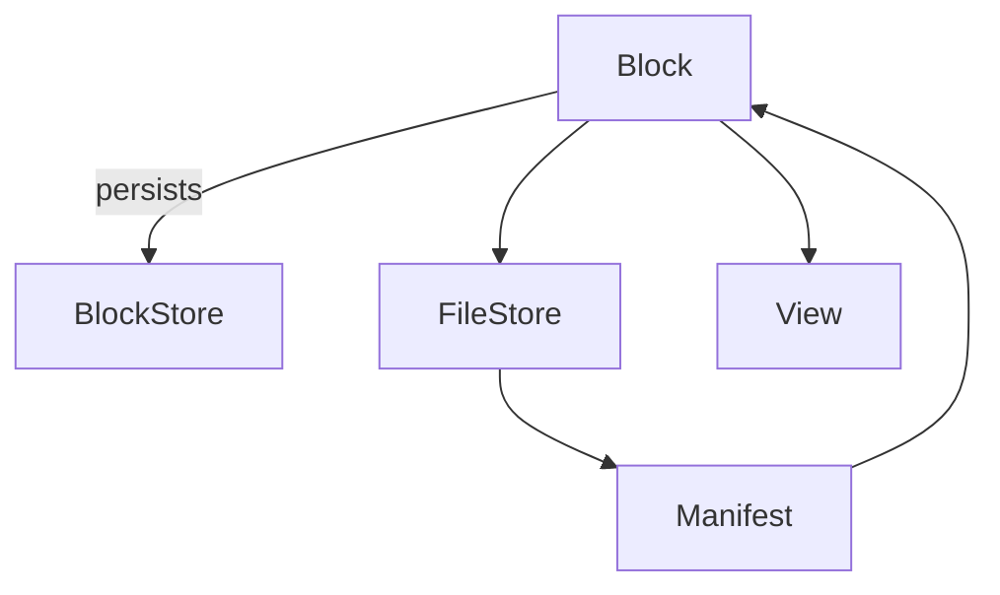
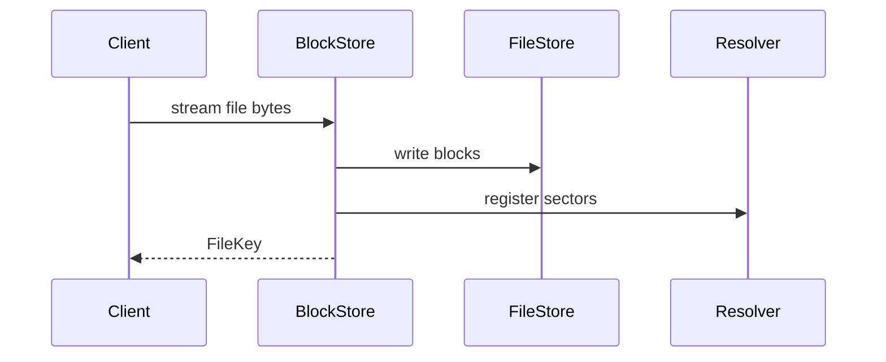

# Graviton

ZIO‑native content‑addressable storage inspired by Binny.

## Features

* Content‑addressable binary store with BLAKE3 hashing
* Pluggable blob stores (filesystem, S3‑compatible, …)
* ZIO Streams‑based APIs for non‑blocking I/O
* Structured logging with correlation IDs
* Prometheus metrics for core operations
* Media type detection utilities backed by Apache Tika

## Architecture





## Quickstart

### CLI

```bash
# ingest bytes
graviton put README.md
# retrieve the blob using the returned key
graviton get <binaryKey> > README.copy.md
```

### HTTP Gateway

Assuming the gateway is running on `localhost:8080`:

```bash
# upload bytes (returns BlobKey)
curl -X POST --data-binary @README.md http://localhost:8080/blobs
# download the stored blob
curl http://localhost:8080/blobs/<blobKey> -o README.copy.md
```

Documentation lives under the [docs](docs/src/main/mdoc/index.md) directory and
is published as part of the project site. Start with the getting started guides
for [installation](docs/src/main/mdoc/getting-started/installation.md) and a
[quick start](docs/src/main/mdoc/getting-started/quick-start.md) example.

See [ROADMAP.md](ROADMAP.md) for the path to v0.1.0.

## Logging

Graviton uses [ZIO Logging](https://zio.dev/reference/logging/) for structured
output. Each major operation logs start, completion and any errors at `info` and
`error` levels. A correlation ID is attached to every request so entries can be
traced across layers.

Loggers and log levels are configured via ZIO layers. For example, to route logs
through SLF4J:

```scala
import zio.Runtime
import zio.logging.backend.SLF4J

val runtime = Runtime.removeDefaultLoggers >>> SLF4J.slf4j
```

The `ZIO_LOG_LEVEL` environment variable controls the minimum level emitted by
the default console logger.

For verifying log output in tests, use `ZTestLogger` to capture log entries:

```scala
import zio.test.ZTestLogger

val program =
  for
    _     <- myBinaryStore.exists(BinaryId("1"))
    logs  <- ZTestLogger.logOutput
  yield assertTrue(logs.nonEmpty)

program.provideLayer(ZTestLogger.default)
```

## Development

Integration tests that rely on Docker are gated behind the `TESTCONTAINERS`
environment variable:

```bash
TESTCONTAINERS=1 ./sbt test
```

This flag is enabled automatically in CI.
