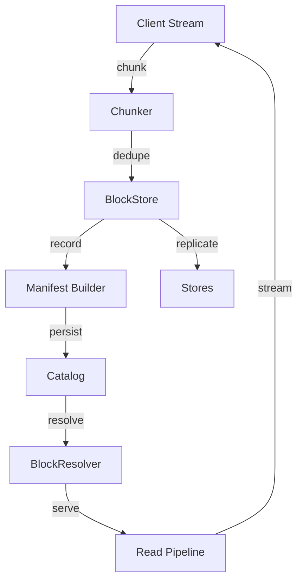

# Graviton

Graviton is a ZIO‑native **content‑addressable storage (CAS)** layer for immutable binary data. It keeps byte streams deduplicated, replicated, and verifiable so higher‑level products (such as Quasar) can focus on document workflows instead of block management.

## Features

* Content‑addressable binary store with BLAKE3 and SHA‑256 hashing strategies.
* Chunker abstraction with fixed, rolling (FastCDC), and anchored chunking implementations.
* Pluggable blob stores (filesystem, S3‑compatible, and future drivers) with replica catalogs.
* ZIO Streams‑based APIs for non‑blocking ingest, range reads, and backpressure control.
* Structured logging with correlation IDs and ingest/read telemetry suitable for observability pipelines.
* Prometheus metrics, audit hooks, and health probes for replication and repair workflows.
* Media type detection and metadata enrichment utilities backed by Apache Tika.

## Core Concepts

Graviton breaks input bytes into deduplicated **Blocks**. Blocks are ordered inside a **Manifest** which defines a logical **Blob**. Blobs are identified by a **BlobKey** (content hash, size, algorithm) and replicated across **Stores**. Detailed definitions for each concept—including invariants, replica lifecycle, and frame formats—live in the [Graviton glossary](docs/src/main/mdoc/concepts.md).

## Architecture



```mermaid
sequenceDiagram
    participant C as Client
    participant BI as BinaryStore
    participant BL as BlockStore
    participant RP as Replicator
    participant RS as BlockResolver

    C->>BI: insert(stream)
    BI->>BL: chunk & store blocks
    BL-->>BI: BlockKeys
    BI->>BI: build manifest & BlobKey
    BI->>RP: schedule replication
    C<<--BI: BlobKey / WritableKey
    C->>BI: openStream(blob)
    BI->>RS: resolve replicas
    RS->>C: stream plaintext bytes
```

## Quickstart

### CLI

```bash
# ingest bytes
graviton put README.md
# retrieve the blob using the returned key
graviton get <binaryKey> > README.copy.md
```

### HTTP Gateway

Assuming the gateway is running on `localhost:8080`:

```bash
# upload bytes (returns BlobKey)
curl -X POST --data-binary @README.md http://localhost:8080/blobs
# download the stored blob
curl http://localhost:8080/blobs/<blobKey> -o README.copy.md
```

Documentation lives under the [docs](docs/src/main/mdoc/index.md) directory and is published as part of the project site. Start with:

* [Installation](docs/src/main/mdoc/getting-started/installation.md)
* [Quick Start](docs/src/main/mdoc/getting-started/quick-start.md)
* [Graviton Glossary](docs/src/main/mdoc/concepts.md) for a full tour of the storage vocabulary and invariants.

See [ROADMAP.md](ROADMAP.md) for the path to v0.1.0.

## Logging

Graviton uses [ZIO Logging](https://zio.dev/reference/logging/) for structured
output. Each major operation logs start, completion and any errors at `info` and
`error` levels. A correlation ID is attached to every request so entries can be
traced across layers.

Loggers and log levels are configured via ZIO layers. For example, to route logs
through SLF4J:

```scala
import zio.Runtime
import zio.logging.backend.SLF4J

val runtime = Runtime.removeDefaultLoggers >>> SLF4J.slf4j
```

The `ZIO_LOG_LEVEL` environment variable controls the minimum level emitted by
the default console logger.

For verifying log output in tests, use `ZTestLogger` to capture log entries:

```scala
import zio.test.ZTestLogger

val program =
  for
    _     <- myBinaryStore.exists(BinaryId("1"))
    logs  <- ZTestLogger.logOutput
  yield assertTrue(logs.nonEmpty)

program.provideLayer(ZTestLogger.default)
```

## Development

Integration tests that rely on Docker are gated behind the `TESTCONTAINERS`
environment variable:

```bash
TESTCONTAINERS=1 ./sbt test
```

This flag is enabled automatically in CI.

To provision the local Postgres instance on demand run:

```bash
./sbt bootstrapPg
```

Automatic bootstrapping is disabled by default to keep sbt startup fast. Set `GRAVITON_BOOTSTRAP_PG=true` if you want sbt to run
it on load.

The documentation site is generated via mdoc and published as a zipped artifact. You can build it locally with:

```bash
./sbt docs/docsSiteArchive
```

The resulting archive is attached when running `publish` or `publishLocal`.
