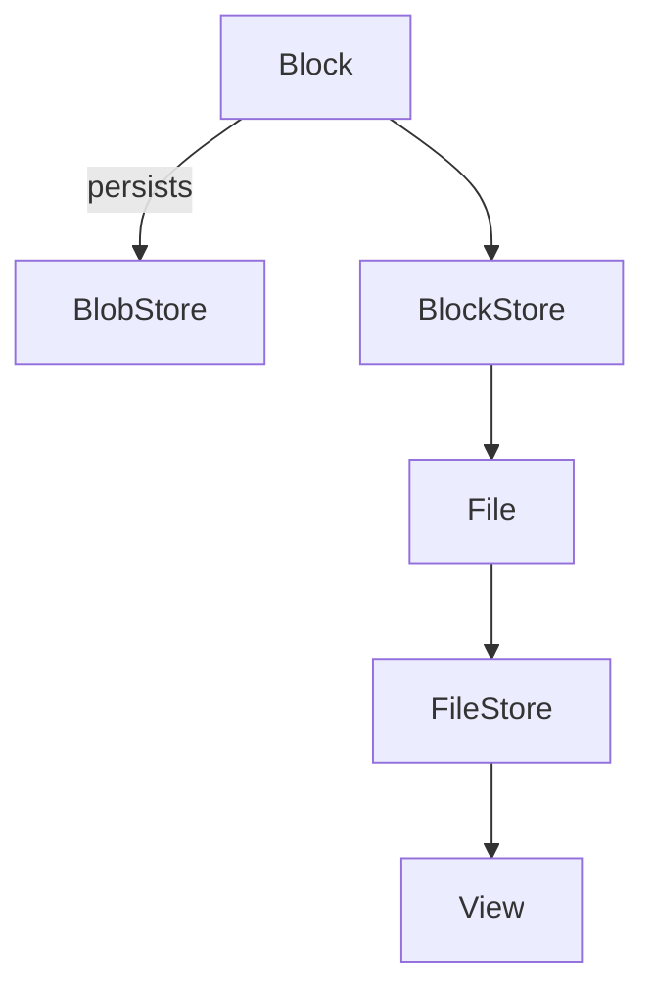
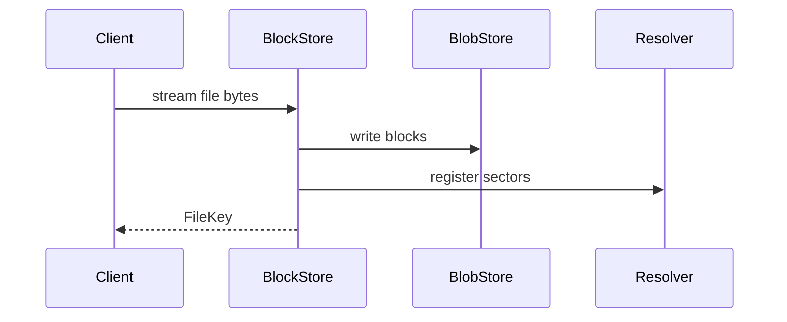

# Graviton

ZIO‑native content‑addressable storage inspired by Binny.

## Features

* Content‑addressable binary store with BLAKE3 hashing
* Pluggable blob stores (filesystem, MinIO/S3, …)
* ZIO Streams based APIs for non‑blocking I/O
* Media type detection utilities backed by Apache Tika

## Architecture





## Quickstart

### CLI

```bash
# ingest a file
graviton put README.md
# retrieve the file using the returned key
graviton get <fileKey> > README.copy.md
```

### HTTP Gateway

Assuming the gateway is running on `localhost:8080`:

```bash
# upload bytes
curl -X POST --data-binary @README.md http://localhost:8080/files
# download the stored file
curl http://localhost:8080/files/<fileKey> -o README.copy.md
```

Documentation lives under the [docs](docs/src/main/mdoc/index.md) directory and
is published as part of the project site.

## Logging

Graviton uses [ZIO Logging](https://github.com/zio/zio-logging) to emit structured
logs for all major operations. Each request is tagged with a correlation ID so
logs can be traced across stores.

Logs default to the `INFO` level on the console. You can adjust the level or
swap out the backend by providing a different logging layer:

```scala
import graviton.Logging
import zio.logging.LogLevel

val logging = Logging.layer(LogLevel.Debug)
```
