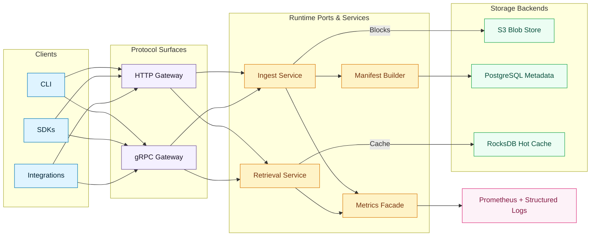

# Architecture

Graviton separates pure domain logic from effectful runtime code.

## High-Level System View

## Core

`graviton-core` contains purely functional data structures and codecs:

- Hashing utilities (`HashAlgo`, `Digest`, `MultiHasher`).
- Binary identifiers (`BinaryKey`, `KeyBits`, `ViewTransform`).
- Locator abstractions (`BlobLocator`, `LocatorStrategy`).
- Range utilities (`Bound`, `Interval`, `Span`, `RangeSet`).
- Manifest encoders and decoders.
- Persistent union-find for replica placement.

## Streams

`graviton-streams` bridges the pure types with ZIO Streams by providing chunkers, hashing sinks, and reusable combinators for fan-out and scanning. These helpers orchestrate the content-defined chunking primitives from the `zio-blocks` submodule.

## Runtime

`graviton-runtime` defines the service ports consumed by the transports and backends. It holds policies, indexes, constraints, and metrics facades while remaining agnostic to concrete storage drivers.

## Protocol

- `graviton-proto`: protobuf contracts for gRPC and derived HTTP routes.
- `graviton-grpc`: zio-grpc services that implement uploads, blob retrieval, and admin features.
- `graviton-http`: zio-http routes exposing REST-style endpoints with JSON codecs derived from zio-schema.

## Backends

Each backend implements the runtime ports using specific technologies:

- `graviton-s3`: AWS SDK v2 object store with multipart uploads.
- `graviton-pg`: PostgreSQL based object and metadata stores.
- `graviton-rocks`: RocksDB based key-value primitives with metrics integration.

## Server

`graviton-server` assembles the runtime into a deployable binary. It wires configuration, selects backend layers, starts HTTP and gRPC frontends, coordinates multipart uploads via shardcake entities, and publishes Prometheus metrics.
