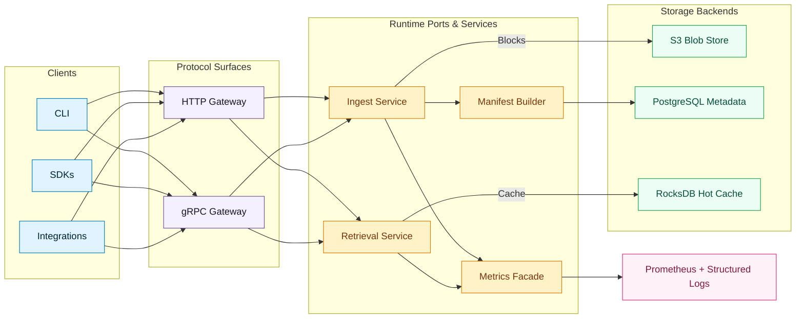
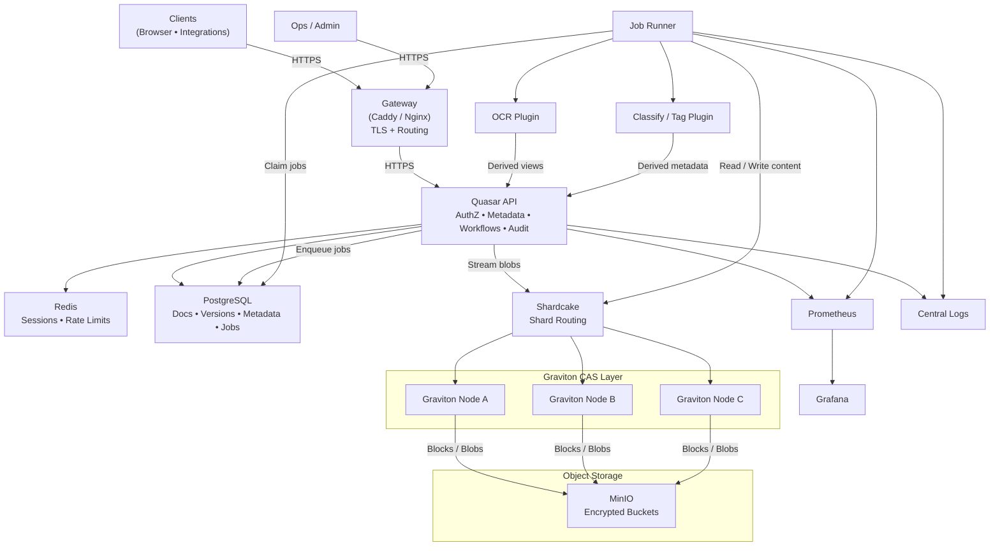

# Architecture

Graviton separates pure domain logic from effectful runtime code.

::: tip Diagram scope
The **High-Level System View** below reflects modules that exist in this repository. The **Quasar + Graviton** topology is a **planned product architecture** (control plane, job runner, multi-node CAS): useful for direction, not a guarantee of what is deployed or wired end-to-end today.
:::

## High-Level System View


```mermaid
flowchart LR
  classDef client fill:#dff4ff,stroke:#0077b6,color:#002233;
  classDef transport fill:#f4f0ff,stroke:#6a4c93,color:#1a1326;
  classDef runtime fill:#fef3c7,stroke:#d97706,color:#78350f;
  classDef backend fill:#ecfdf3,stroke:#16a34a,color:#064e3b;
  classDef ops fill:#fdf2f8,stroke:#db2777,color:#831843;

  subgraph Clients["Clients"]
    cli["CLI"]
    sdks["SDKs"]
    integ["Integrations"]
  end

  subgraph Transports["Protocol Surfaces"]
    http["HTTP Gateway"]
    grpc["gRPC Gateway"]
  end

  subgraph Runtime["Runtime Ports & Services"]
    ingest["Ingest Service"]
    retrieve["Retrieval Service"]
    manifest["Manifest Builder"]
    metrics["Metrics Facade"]
  end

  subgraph Backends["Storage Backends"]
    s3["S3 Blob Store"]
    pg["PostgreSQL Metadata"]
    rocks["RocksDB Hot Cache"]
  end

  observability["Prometheus + Structured Logs"]

  cli --> http
  cli --> grpc
  sdks --> http
  sdks --> grpc
  integ --> http
  integ --> grpc
  http --> ingest
  grpc --> ingest
  http --> retrieve
  grpc --> retrieve
  ingest --> manifest
  manifest --> pg
  ingest -->|Blocks| s3
  retrieve -->|Cache| rocks
  metrics --> observability
  ingest --> metrics
  retrieve --> metrics

  class cli,sdks,integ client
  class http,grpc transport
  class ingest,retrieve,manifest,metrics runtime
  class s3,pg,rocks backend
  class observability ops
```

**Accuracy notes for this diagram:** the **CLI** is the `graviton-cli` SBT project (`./sbt "cli/run …"`), not a separate binary artifact. **gRPC** is not started by `server/run` today. **RocksDB** is a backend module but is not required for the default HTTP + Postgres + fs/S3 flows.

## Quasar + Graviton (service topology)


```mermaid
flowchart TB
  %% ===== Clients =====
  Clerk["Clients\n(Browser • Integrations)"]
  Admin["Ops / Admin"]

  %% ===== Edge =====
  GW["Gateway\n(Caddy / Nginx)\nTLS + Routing"]

  %% ===== Quasar =====
  QAPI["Quasar API\nAuthZ • Metadata • Workflows • Audit"]
  R["Redis\nSessions • Rate Limits"]

  %% ===== Database =====
  PG["PostgreSQL\nDocs • Versions • Metadata • Jobs"]

  %% ===== Storage Routing =====
  SC["Shardcake\nShard Routing"]

  %% ===== CAS Layer =====
  subgraph Graviton["Graviton CAS Layer"]
    G1["Graviton Node A"]
    G2["Graviton Node B"]
    G3["Graviton Node C"]
  end

  %% ===== Object Storage =====
  subgraph ObjectStore["Object Storage"]
    MIO["MinIO\nEncrypted Buckets"]
  end

  %% ===== Jobs / Plugins =====
  JR["Job Runner"]
  OCR["OCR Plugin"]
  CLS["Classify / Tag Plugin"]

  %% ===== Observability =====
  P["Prometheus"]
  G["Grafana"]
  L["Central Logs"]

  %% ===== Client Flow =====
  Clerk -->|HTTPS| GW
  Admin -->|HTTPS| GW
  GW -->|HTTPS| QAPI

  %% ===== Core Dependencies =====
  QAPI --> PG
  QAPI --> R

  %% ===== Storage Flow =====
  QAPI -->|Stream blobs| SC
  SC --> G1
  SC --> G2
  SC --> G3

  %% ===== CAS to Object Store =====
  G1 -->|Blocks / Blobs| MIO
  G2 -->|Blocks / Blobs| MIO
  G3 -->|Blocks / Blobs| MIO

  %% ===== Job Execution =====
  QAPI -->|Enqueue jobs| PG
  JR -->|Claim jobs| PG
  JR -->|Read / Write content| SC
  JR --> OCR
  JR --> CLS
  OCR -->|Derived views| QAPI
  CLS -->|Derived metadata| QAPI

  %% ===== Observability =====
  QAPI --> P
  JR --> P
  P --> G
  QAPI --> L
  JR --> L
```

## Transducer Algebra

The **Transducer algebra** is the composable pipeline engine that sits between the pure core and the effectful runtime. Transducers compose via `>>>` (sequential) and `&&&` (fanout) with automatic Record-state merging:

```
bytes → countBytes >>> hashBytes >>> rechunk(blockSize) → CanonicalBlock
```

Each transducer produces a typed Record summary. After composition, the summary contains **all** named fields from **all** stages — accessible by name, never by index. Production stages live in `IngestPipeline`, `Transducers`, `CasIngest`, `BombGuard`, `ThroughputMonitor`, and `BlockVerify` (see [Transducer Algebra](./core/transducers.md)); **compression and aggregate framing** in the explorer UI are **roadmap** visuals, not fully implemented transducer chains yet. Transducers compile to `ZSink`, `ZPipeline`, or `ZChannel`.

See the [Transducer Algebra](./core/transducers.md) page for the full API, or try the [Pipeline Explorer](./pipeline-explorer.md) to compose stages interactively.

## Core

`graviton-core` contains purely functional data structures and codecs:

- Hashing utilities (`HashAlgo`, `Digest`, `MultiHasher`).
- Binary identifiers (`BinaryKey`, `KeyBits`, `ViewTransform`).
- Locator abstractions (`BlobLocator`, `LocatorStrategy`).
- Range utilities (`Bound`, `Interval`, `Span`, `RangeSet`).
- Manifest encoders and decoders.
- A small `UnionFind` helper (`graviton.core.uf`); **replica placement** that uses it across the runtime is **planned**, not wired through ingest today.

## Streams

`graviton-streams` bridges the pure types with ZIO Streams by providing chunkers, hashing sinks, and reusable combinators for fan-out and scanning. These helpers orchestrate the content-defined chunking primitives from the `zio-blocks-schema` library (published to Maven Central).

## Runtime

`graviton-runtime` defines the service ports consumed by the transports and backends. It holds policies, indexes, constraints, and metrics facades while remaining agnostic to concrete storage drivers.

## Protocol

- `graviton-proto`: protobuf contracts for gRPC (and related HTTP design).
- `graviton-grpc`: generated stubs and service scaffolding; **end-to-end gRPC serving** from `graviton-server` is **not** at parity with HTTP yet (see [gRPC API](./api/grpc.md)).
- `graviton-http`: zio-http routes (blob upload/download, dashboard snapshot/stream, health); see [HTTP API](./api/http.md).

## Backends

Each backend implements the runtime ports using specific technologies:

- `graviton-s3`: AWS SDK v2 object store with multipart uploads.
- `graviton-pg`: PostgreSQL based object and metadata stores.
- `graviton-rocks`: RocksDB based key-value primitives with metrics integration.

## Server

`graviton-server` assembles the runtime into a deployable process. It wires configuration, selects block storage (`fs` or S3-compatible) with Postgres-backed manifests, starts the **HTTP** server (`/api/blobs`, health, metrics), and registers an in-memory metrics registry. **gRPC**, **Shardcake**, and **multipart entity coordination** are **planned or partial** — they are not the primary path for local demos today.
