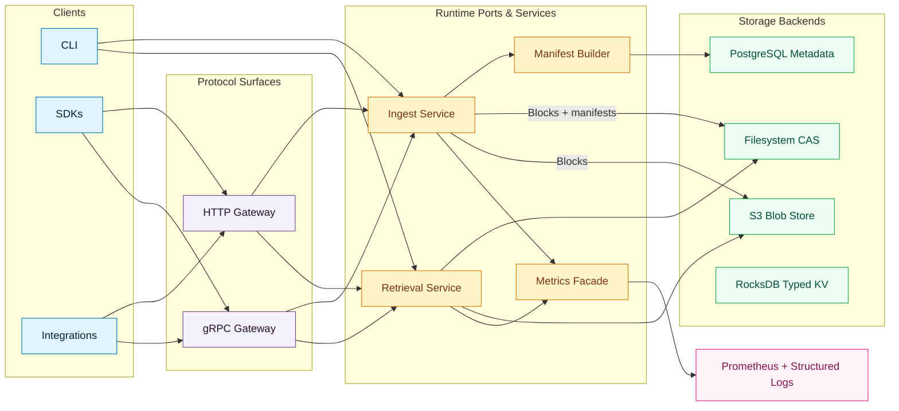
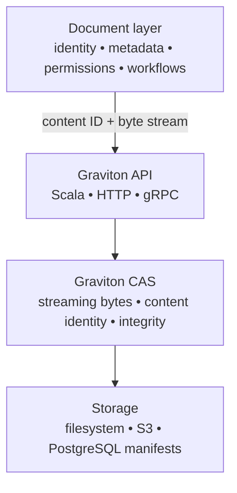

# Architecture

Graviton separates pure byte and identity logic from effectful storage and transport code. It deliberately stops below document semantics.

::: tip Diagram scope
The **High-Level System View** below contains only Graviton release surfaces. Source-only document-layer prototypes in this repository are not server capabilities, published modules, or deployable Graviton services.
:::

## High-Level System View


```mermaid
flowchart LR
  classDef client fill:#dff4ff,stroke:#0077b6,color:#002233;
  classDef transport fill:#f4f0ff,stroke:#6a4c93,color:#1a1326;
  classDef runtime fill:#fef3c7,stroke:#d97706,color:#78350f;
  classDef backend fill:#ecfdf3,stroke:#16a34a,color:#064e3b;
  classDef ops fill:#fdf2f8,stroke:#db2777,color:#831843;

  subgraph Clients["Clients"]
    cli["CLI"]
    sdks["SDKs"]
    integ["Integrations"]
  end

  subgraph Transports["Protocol Surfaces"]
    http["HTTP Gateway"]
    grpc["gRPC Gateway"]
  end

  subgraph Runtime["Runtime Ports & Services"]
    ingest["Ingest Service"]
    retrieve["Retrieval Service"]
    manifest["Manifest Builder"]
    metrics["Metrics Facade"]
  end

  subgraph Backends["Storage Backends"]
    fs["Filesystem CAS"]
    s3["S3 Blob Store"]
    pg["PostgreSQL Metadata"]
    rocks["RocksDB Typed KV"]
  end

  observability["Prometheus + Structured Logs"]

  cli --> ingest
  cli --> retrieve
  sdks --> http
  sdks --> grpc
  integ --> http
  integ --> grpc
  http --> ingest
  grpc --> ingest
  http --> retrieve
  grpc --> retrieve
  ingest --> manifest
  manifest --> pg
  ingest -->|Blocks + manifests| fs
  retrieve --> fs
  ingest -->|Blocks| s3
  retrieve --> s3
  metrics --> observability
  ingest --> metrics
  retrieve --> metrics

  class cli,sdks,integ client
  class http,grpc transport
  class ingest,retrieve,manifest,metrics runtime
  class fs,s3,pg,rocks backend
  class observability ops
```

**Accuracy notes for this diagram:** the **CLI** is the `graviton-cli` SBT project (`./sbt "cli/run …"`) and opens its configured store directly. The packaged server starts HTTP on `8081` and gRPC on `9090` by default. **RocksDB** is an operational typed KV library adapter, not an implicit retrieval cache and not part of the default filesystem or S3 plus PostgreSQL server compositions.

## Product boundary


```mermaid
flowchart TB
  document["Document layer\nidentity • metadata • permissions • workflows"]
  api["Graviton API\nScala • HTTP • gRPC"]
  cas["Graviton CAS\nstreaming bytes • content identity • integrity"]
  storage["Storage\nfilesystem • S3 • PostgreSQL manifests"]

  document -->|"content ID + byte stream"| api
  api --> cas
  cas --> storage
```

Graviton owns the lower three boxes. A downstream system may retain a Graviton content ID and stream bytes through the API, but document identity, versions, metadata, permissions, search, and workflows remain above this boundary and outside this repository. See [Scope and product boundary](./scope.md).

## Transducer Algebra

The **Transducer algebra** is a separate composable pure-processing library. The production runtime reuses its block-key transformation but keeps orchestration in ZIO Streams. Transducers compose via `>>>` (sequential) and `&&&` (fanout) with Record-state merging:

```
bytes → countBytes >>> hashBytes >>> rechunk(blockSize) → CanonicalBlock
```

Each transducer has a typed summary shape, and composition merges those shapes. The recommended `IngestPipeline.countHashRechunkSummary` and `CasIngest.pipelineSummary` entry points map terminal state to explicit ZIO Blocks schema-backed products, so new code does not rely on dynamic Kyo Record access. Their v0.7 names remain as deprecated binary-compatible shims. Implemented transformations live in `IngestPipeline`, `Transducers`, `CasIngest`, `BombGuard`, `ThroughputMonitor`, and `BlockVerify` (see [Transducer Algebra](./core/transducers.md)). Compression and aggregate framing remain roadmap work and are not presented as operational features. Transducers compile to `ZSink`, `ZPipeline`, or `ZChannel`, with the collecting `ZSink` restricted to bounded inputs.

See the [Transducer Algebra](./core/transducers.md) page for the full API and implemented-stage boundaries.

## Core

`graviton-core` contains purely functional data structures and codecs:

- Hashing utilities (`HashAlgo`, `Digest`, `MultiHasher`).
- Binary identifiers (`BinaryKey`, `KeyBits`, `ViewTransform`).
- Locator abstractions (`BlobLocator`, `LocatorStrategy`).
- Range utilities (`Bound`, `Interval`, `Span`, `RangeSet`).
- Manifest encoders and decoders.
- A small `UnionFind` helper (`graviton.core.uf`). Runtime replica placement is a separate implemented rendezvous service and does not depend on `UnionFind`.

## Streams

`graviton-streams` bridges the pure types with ZIO Streams by providing bounded chunkers, hashing sinks, and reusable combinators for fan-out and scanning. The transfer engine remains on ZIO Streams. ZIO Blocks Schema is used for bounded cross-platform API contracts, not for arbitrary blob streams.

## Runtime

`graviton-runtime` defines the service ports consumed by the transports and backends. It holds policies, indexes, constraints, and metrics facades while remaining agnostic to concrete storage drivers.

## Protocol

- `graviton-proto`: protobuf contracts for gRPC (and related HTTP design).
- `graviton-grpc`: generated stubs, a bounded streaming client, and the packaged server listener. It covers the core blob lifecycle; HTTP additionally provides ranges, preconditions, and verification (see [gRPC API](./api/grpc.md)).
- `graviton-http`: zio-http routes (blob upload/download, dashboard snapshot/stream, health); see [HTTP API](./api/http.md).

## Backends

Each backend implements the runtime ports using specific technologies:

- `graviton-s3`: AWS SDK v2 block storage with MinIO support, readiness, retries, strict duplicate validation, and quarantine controls.
- `graviton-pg`: transactional PostgreSQL manifest, audit, ACL, and replica-index persistence.
- `graviton-rocks`: RocksDB based key-value primitives with metrics integration.

## Server

`graviton-server` assembles the runtime into a deployable process. It wires configuration, selects filesystem storage or S3 blocks plus PostgreSQL manifests, starts the versioned HTTP and streaming gRPC listeners, enforces optional OIDC and capability policy on both transports, exposes backend-aware readiness, and registers process metrics. When configured, it also mounts deterministic multi-target block placement and supervised repair. Resumable HTTP sessions use a durable filesystem or PostgreSQL ledger and a separate streamed staging store before final content-aware CAS ingest. When `GRAVITON_SHARDCAKE_ENABLED=true`, the node additionally starts authenticated control and direct-stream listeners and routes final ingest for a typed session to a stable owner.
