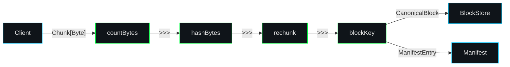

# End-to-end Upload

The upload path streams bytes from clients to durable storage while computing content hashes and building manifests.

## Pipeline overview



## Upload stages

1. **Session negotiation** – a client opens a gRPC bidi stream or HTTP session. The server allocates a shard-backed session entity with spill buffers and MultiHasher state.
2. **Chunking** – `graviton-streams` chunkers split the byte stream using either fixed-size or content-defined boundaries. Chunks feed incremental hashers from `graviton-core`.
3. **Storage layout** – the runtime derives `BinaryKey` values for blocks, chunks, and manifests. Locator strategies map these keys to backend-specific paths.
4. **Persistence** – the `MutableObjectStore` implementation uploads parts, respecting backend-specific minimum sizes (for example, 5 MiB for S3 multipart uploads). Range trackers record which spans succeeded.
5. **Manifest emission** – once all blocks are written, a manifest describing order, sizes, and attributes is persisted. The blob key is returned to the client alongside metadata captured in `BlobWriteResult`.
6. **Replication** – optional background jobs use `ReplicaIndex` and `UnionFind` utilities to drive additional copies or repairs.

## Transducer-based ingest (next generation)

The [Transducer algebra](./core/transducers.md) enables a cleaner expression of the same pipeline:

```scala
// Compose typed stages
val ingest = countBytes >>> hashBytes >>> rechunk(blockSize) >>> blockKeyDeriver

// Run the pipeline — get a typed summary
val (summary, blocks) = byteStream.run(ingest.toSink)
summary.totalBytes   // Long
summary.digestHex    // String
summary.blockCount   // Long
summary.blocksKeyed  // Long
```

Every field in the summary is accessed by name (not index), and the composition merges Record states automatically via `StateMerge`. See the [Pipeline Explorer](./pipeline-explorer.md) to experiment with different stage combinations interactively.

## See also

- [Binary Streaming Guide](./guide/binary-streaming.md) — detailed walkthrough of blocks, manifests, and attributes
- [Transducer Algebra](./core/transducers.md) — the composable pipeline engine
- [Pipeline Explorer](./pipeline-explorer.md) — interactive transducer visualization
- [Chunking Strategies](./ingest/chunking.md) — FastCDC, fixed, and delimiter algorithms
