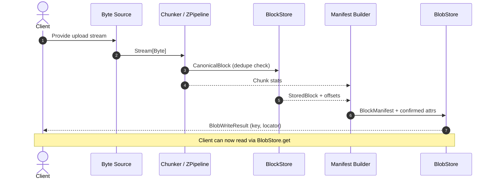

# Binary Streaming Guide

Graviton treats every upload as a binary stream that becomes an ordered graph of blocks, manifests, and attributes. This guide collects the moving pieces so you can wire an ingest pipeline (CLI, gateway, or background job) without guessing how blocks are shaped or how metadata flows back to callers.

## Concept map

| Artifact | Description | Defined in |
| --- | --- | --- |
| **Block** | Canonical chunk of bytes with refined size bounds and a `BinaryKey.Block` derived from its content. Blocks are deduplicated globally. | `graviton.runtime.model.CanonicalBlock`, `BlockStore` |
| **Blob** | Logical object addressable via `BinaryKey`. Blobs reference manifests and carry attributes that survive deduplication. | `graviton.runtime.stores.BlobStore` |
| **Manifest** | Ordered list of block entries (`index`, `offset`, `key`, `size`) plus total length. Serialized as frames for durability and encryption. | `BlockManifest`, [`manifests-and-frames`](../manifests-and-frames.md) |
| **Attributes** | Tracked metadata split between advertised (client supplied) and confirmed (server verified) values such as size, MIME, and digests. | `graviton.core.attributes.BinaryAttributes` |
| **Chunker** | A `ZPipeline[Any, Chunker.Err, Byte, Block]` that turns byte streams into canonical blocks. Chooses boundaries, normalization, and rechunking rules. | [`ingest/chunking`](../ingest/chunking.md) |

## End-to-end flow



1. A byte source (`ZStream` from files, HTTP bodies, etc.) feeds a chunker chosen for size vs deduplication trade-offs.
2. Each canonical block is hashed, typed, and streamed into the `BlockStore` sink returned by `putBlocks`.
3. The block batch result exposes stored vs duplicate blocks so manifests only list committed data.
4. Blob assembly wires the manifest together, enriches attributes (size, chunk count, MIME), and persists the manifest frame beside the blob pointer.
5. The caller receives a `BlobWriteResult` keyed by the logical blob hash and can immediately read the blob via `BlobStore.get`.

## Wiring chunkers, blocks, and manifests

<!-- snippet:binary-streaming-ingest:start -->
```scala
import graviton.core.attributes.BinaryAttributes
import graviton.core.bytes.Hasher
import graviton.core.keys.{BinaryKey, KeyBits}
import graviton.core.model.Block.*
import graviton.core.types.{ChunkCount, FileSize, UploadChunkSize}
import graviton.runtime.model.{BlockBatchResult, CanonicalBlock}
import graviton.runtime.stores.BlockStore
import graviton.streams.Chunker
import zio._
import zio.stream._

extension [E, A](either: Either[E, A])
  def toTask(using E <:< String): Task[A] = ZIO.fromEither(either.left.map(msg => new IllegalArgumentException(msg)))

final case class Ingest(blockStore: BlockStore):

  private def canonicalBlock(block: Chunk[Byte], attrs: BinaryAttributes): Either[String, CanonicalBlock] =
    for
      hasher     <- Hasher.systemDefault
      algo        = hasher.algo
      _           = hasher.update(block.toArray)
      digest     <- hasher.digest
      bits       <- KeyBits.create(algo, digest, block.length.toLong)
      key        <- BinaryKey.block(bits)
      chunkCount <- ChunkCount.either(1L)
      size       <- FileSize.either(block.length.toLong)
      confirmed   = attrs
                      .confirmSize(size)
                      .confirmChunkCount(chunkCount)
      canonical  <- CanonicalBlock.make(key, block, confirmed)
    yield canonical

  def run(bytes: ZStream[Any, Throwable, Byte]): Task[BlockBatchResult] =
    val attrs     = BinaryAttributes.empty
    val sink      = blockStore.putBlocks()
    val chunkSize = UploadChunkSize(1 * 1024 * 1024) // compile-time refined

    for result <- bytes
                    .via(Chunker.fixed(chunkSize).pipeline.mapError(Chunker.toThrowable))
                    .mapZIO(block => canonicalBlock(block.bytes, attrs).toTask)
                    .run(sink)
    yield result
```
<!-- snippet:binary-streaming-ingest:end -->

_Snippet source: `docs/snippets/src/main/scala/graviton/docs/guide/BinaryStreamingIngest.scala` (managed via `sbt syncDocSnippets`)._

- **Backend-specific size caps**: use `ByteConstraints.enforceFileLimit(bytes, config.maxBlobBytes)` whenever you hydrate a backend config (filesystem quota, S3 object cap, etc.). The core `FileSize` refinement only ensures non-negative longs so each store can apply its own ceiling without fighting the type system.
- **Chunkers emit typed blocks**: Every chunker returns a `Block` that already satisfies `MaxBlockBytes` and related refined constraints.
- **Incremental chunking core**: `graviton.streams.Chunker` is backed by a small, bounded incremental cutter and can also be used as a plain state machine via `graviton.streams.ChunkerCore` (useful for tests/benchmarks or lifting into non-ZIO runtimes).
- **Hashing before storage** keeps keys stable regardless of backend. `HashAlgo.default` (currently BLAKE3) is the runtime’s default, but you can still opt into SHA-256 for FIPS-bound workflows.
- **`BlockWritePlan` controls framing**: choose compression, encryption, and whether duplicates should be forwarded downstream for multi-tenant replication.

## Attribute lifecycle

`BinaryAttributes` tracks provenance via `Tracked` values so the most trusted source wins. During ingest, write the best knowledge you have (advertised size, client MIME type). As the stream is chunked, confirm derived facts:

```scala
import graviton.core.attributes.{BinaryAttributes, Source, Tracked}
import graviton.core.bytes.HashAlgo

val initial = BinaryAttributes.empty
  .advertiseMime(Tracked.now("application/pdf", Source.ProvidedUser))

val confirmed = initial
  .confirmSize(Tracked.now(fileSize, Source.Derived))
  .confirmChunkCount(Tracked.now(blockCount, Source.Derived))
  .confirmDigest(HashAlgo.Sha256, Tracked.now(blobDigest, Source.Verified))
```

When the manifest is sealed, the confirmed attributes are persisted next to the blob key. Reads return the merged view so callers always see verified data when available.

Need structured change reports? The [`Schema-driven diffs`](../core/schema.md#schema-driven-diffs) section shows how to hang `zio.schema.Schema` instances off each `BinaryAttributeKey`, convert the advertised/confirmed maps into `DynamicValue.Record`s, and run `zio.schema.diff.Diff` (or even JSON diff tools) without giving up the `Tracked` provenance we rely on during ingest.

## Manifest composition and frames

Manifests enumerate blocks in order so retrieval is a pure streaming exercise:

1. `BlockManifestEntry` records the block index, byte offset, canonical block key, and uncompressed size.
2. `BlockManifest.build` validates that offsets never go backwards and that totals match the confirmed size.
3. `FrameSynthesis` chooses how the manifest and block frames are serialized (plain, compressed, encrypted) before shipping to a `BlobStore` implementation.

For an in-depth look at framing guarantees, encryption plans, and forward compatibility, see [`Manifests & Frames`](../manifests-and-frames.md).

## Frame codecs & streaming

- **Structured frame encoding**: `graviton.runtime.model.BlockFrameCodec.codec` is the canonical `scodec.Codec[BlockFrame]`. It keeps `FrameHeader` lengths honest (payload vs. AAD) and normalizes the authenticated data to a compact binary layout rather than ad-hoc JSON blobs.
- **Streaming transforms**: `BlockFrameStreams.encode`/`decode` expose `ZPipeline`s so you can push `ZStream[BlockFrame]` over the wire (gRPC, WebSocket, files) without buffering entire manifests. Compose them with compression/encryption pipelines to keep ingestion and replication purely streaming.
- **Aad helpers**: `BlockFrameCodec.renderAadBytes` mirrors the runtime encoder so external producers (Rust, Go, etc.) can stay byte-for-byte compatible by mimicking the emitted binary format.

## Chunking strategy quick reference

- **Fixed-size** chunking maximizes throughput and predictable offsets. Use for append-only logs or when deduplication is irrelevant.
- **FastCDC** balances speed and deduplication. Adjust normalization to bias toward smaller or larger blocks.
- **Anchored CDC** lets you split on format-aware anchors (PDF `endobj`, ZIP headers) for structured documents.
- **BuzHash / Rabin** provide classic rolling-hash behavior when cross-language parity matters.

The [Chunking Strategies guide](../ingest/chunking.md) provides detailed configuration snippets, decision trees, and performance notes.

## Retrieval & reassembly

Fetching a blob reverses the ingest pipeline:

1. `BlobStore.get` loads the manifest frame and attributes by blob key.
2. The runtime streams block keys through the `BlockStore`, optionally verifying digests on the fly.
3. Blocks are reassembled into a `ZStream[Byte]`. Partial reads use manifest offsets so large blobs can seek without decoding the entire payload.

Because manifest offsets and chunk counts are validated during ingest, retrieval never needs to buffer the whole object; the runtime can resume from any block boundary and still honor encryption or compression frames.

## Namespace metadata as DynamicValue

- **Canonical form**: each namespace resolves to a `NamespaceBlock` whose `data` field is a `zio.schema.DynamicValue.Record`. `NamespacesDyn` just hangs on to a map of `NamespaceUrn -> NamespaceBlock` plus a routing table of schema IDs for migrations.
- **Typed helpers**: `DynamicRecordCodec.toRecord` / `fromRecord` wrap `Schema.toDynamic` and `Schema.fromDynamic` so system schemas can keep compiling down to DynamicValue while remaining typesafe.
- **Encoding**: `DynamicJsonCodec.encodeDynamic/decodeDynamicRecord` bridge DynamicValue ↔ `zio.json.ast.Json`. For system namespaces the flow is JSON → typed meta → DynamicValue.Record; for tenant namespaces you can skip the typed hop and work directly with DynamicValue once validation succeeds.

## Transducer-based ingest (next generation)

The [Transducer algebra](../core/transducers.md) provides a cleaner, composable alternative to the manual queue/fiber orchestration in `CasBlobStore.put()`. The same ingest pipeline can be expressed as:

```scala
val pipeline = countBytes >>> hashBytes >>> rechunk(blockSize) >>> blockKeyDeriver
val (summary, blocks) = byteStream.run(pipeline.toSink)
// summary.totalBytes, summary.digestHex, summary.blockCount — all named fields
```

This approach is testable in isolation (no ZIO needed for unit tests), produces typed Record summaries, and composes with verification and deduplication stages via `>>>` and `&&&`. See the [Pipeline Explorer](../pipeline-explorer.md) to experiment interactively.

## Next steps

- Start from [`guide/getting-started`](./getting-started.md) to build and run the project locally.
- Try the [Pipeline Explorer](../pipeline-explorer.md) to compose transducer stages interactively.
- Dive into [`ingest/chunking`](../ingest/chunking.md) for algorithm-level tuning.
- Read the [Transducer Algebra](../core/transducers.md) for the full composition API.
- Explore [`runtime/ports`](../runtime/ports.md) to see how stores, protocols, and schedulers compose inside the runtime.
