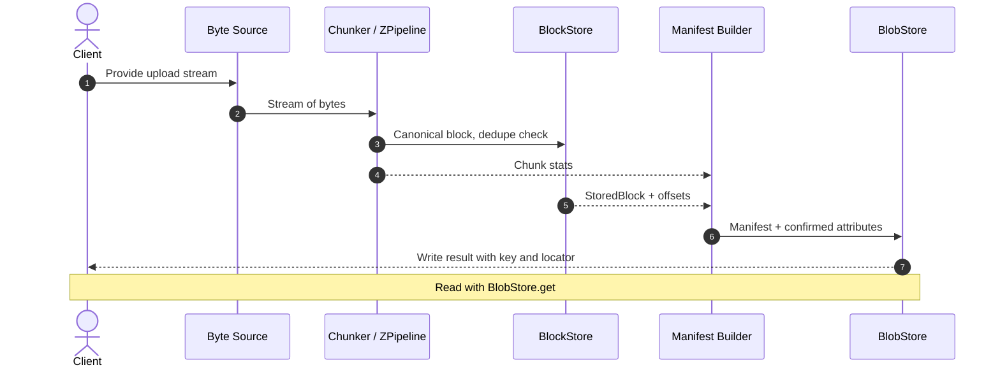

# Binary Streaming Guide

Graviton treats every upload as a binary stream that becomes an ordered graph of blocks, manifests, and attributes. This guide collects the moving pieces so you can wire an ingest pipeline (CLI, gateway, or background job) without guessing how blocks are shaped or how metadata flows back to callers.

## Concept map

| Artifact | Description | Defined in |
| --- | --- | --- |
| **Block** | Canonical chunk of bytes with refined size bounds and a `BinaryKey.Block` derived from its content. Blocks are deduplicated globally. | `graviton.runtime.model.CanonicalBlock`, `BlockStore` |
| **Blob** | Logical object addressable via `BinaryKey`. Its manifest survives block deduplication; confirmed attributes are returned to the caller but are not yet durably stored in the CAS manifest. | `graviton.runtime.stores.BlobStore` |
| **Manifest** | Ordered block references (`index`, `offset`, `key`, `size`) plus total length. Filesystem storage uses `GVM2`; PostgreSQL uses relational rows. The separate frame codec is not the manifest repository format. | `BlobManifestRepo`, [`manifests-and-frames`](../manifests-and-frames.md) |
| **Attributes** | Tracked metadata split between advertised (client supplied) and confirmed (server verified) values such as size, MIME, and digests. | `graviton.core.attributes.BinaryAttributes` |
| **Chunker** | A `ZPipeline[Any, Chunker.Err, Byte, Block]` that turns byte streams into canonical blocks. Chooses boundaries, normalization, and rechunking rules. | [`ingest/chunking`](../ingest/chunking.md) |

## End-to-end flow


```mermaid
sequenceDiagram
  autonumber
  actor Client
  participant Src as Byte Source
  participant Chunker as Chunker / ZPipeline
  participant Blocks as BlockStore
  participant Manifest as Manifest Builder
  participant Blob as BlobStore

  Client->>Src: Provide upload stream
  Src->>Chunker: Stream of bytes
  Chunker->>Blocks: Canonical block, dedupe check
  Chunker-->>Manifest: Chunk stats
  Blocks-->>Manifest: StoredBlock + offsets
  Manifest->>Blob: Manifest + confirmed attributes
  Blob-->>Client: Write result with key and locator
  Note over Client,Blob: Read with BlobStore.get
```

1. A byte source (`ZStream` from files, HTTP bodies, etc.) feeds a chunker chosen for size vs deduplication trade-offs.
2. Each canonical block is hashed, typed, and persisted through `BlockStore.putBlock`; the CAS ingest path never retains a whole-upload block batch.
3. Each successful write appends one key, offset, and length entry to a disk-backed manifest spool while retaining only scalar counters in memory.
4. Once the full-stream digest is known, the runtime replays the spool into the selected manifest repository in bounded batches and confirms size and digest attributes for the write result.
5. The caller receives a `BlobWriteResult` keyed by the logical blob hash and can immediately read the blob via `BlobStore.get`.

## Wiring chunkers, blocks, and manifests

<!-- snippet:binary-streaming-ingest:start -->
```scala
import graviton.core.attributes.BinaryAttributes
import graviton.core.bytes.Hasher
import graviton.core.keys.{BinaryKey, KeyBits}
import graviton.core.model.Block
import graviton.core.model.Block.*
import graviton.core.types.{ChunkCount, FileSize, UploadChunkSize}
import graviton.runtime.model.{BlockBatchResult, CanonicalBlock}
import graviton.runtime.stores.BlockStore
import graviton.streams.Chunker
import zio._
import zio.stream._

extension [E, A](either: Either[E, A])
  def toTask(using E <:< String): Task[A] = ZIO.fromEither(either.left.map(msg => new IllegalArgumentException(msg)))

final case class Ingest(blockStore: BlockStore):

  private def canonicalBlock(block: Block, attrs: BinaryAttributes): Either[String, CanonicalBlock] =
    for
      hasher     <- Hasher.systemDefault
      algo        = hasher.algo
      _           = hasher.update(block.bytes)
      digest     <- hasher.digest
      bits       <- KeyBits.create(algo, digest, block.length.toLong)
      key        <- BinaryKey.block(bits)
      chunkCount <- ChunkCount.either(1L)
      size       <- FileSize.either(block.length.toLong)
      confirmed   = attrs
                      .confirmSize(size)
                      .confirmChunkCount(chunkCount)
      canonical  <- CanonicalBlock.make(key, block.bytes, confirmed)
    yield canonical

  def run(bytes: ZStream[Any, Throwable, Byte]): Task[BlockBatchResult] =
    val attrs     = BinaryAttributes.empty
    val sink      = blockStore.putBlocks()
    val chunkSize = UploadChunkSize(1 * 1024 * 1024) // compile-time refined

    for result <- bytes
                    .via(Chunker.fixed(chunkSize).pipeline.mapError(Chunker.toThrowable))
                    .mapZIO(block => canonicalBlock(block, attrs).toTask)
                    .run(sink)
    yield result
```
<!-- snippet:binary-streaming-ingest:end -->

_Snippet source: `docs/snippets/src/main/scala/graviton/docs/guide/BinaryStreamingIngest.scala` (managed via `sbt syncDocSnippets`)._

- **Blob size bound**: `FileSize` is an Iron-refined positive `Long` capped at 1 TiB. Backends may enforce a lower operational quota with `ByteConstraints.enforceFileLimit(bytes, config.maxBlobBytes)`.
- **Chunkers emit typed blocks**: Every chunker returns a `Block` that already satisfies `MaxBlockBytes` and related refined constraints.
- **Incremental chunking core**: `graviton.streams.Chunker` is backed by a small, bounded incremental cutter and can also be used as a plain state machine via `graviton.streams.ChunkerCore` (useful for tests/benchmarks or lifting into non-ZIO runtimes).
- **Hashing before storage** keeps keys stable regardless of backend. `HashAlgo.default` is currently SHA-256. SHA-1 remains a legacy key option; BLAKE3 execution requires an installed provider and is never substituted silently.
- **`BlockWritePlan` controls ingest metadata and program selection**: the operational CAS path supports optional ingest pipelines/scans, attributes, and a locator hint. The separate `BlockFramer` supports only plain block-per-frame synthesis in this release.

## Runtime memory contract

`CasBlobStore` copies arbitrary caller-owned chunks into fixed 64 KiB I/O chunks before hashing or queueing them. Its default queues retain at most:

```text
4 × 64 KiB input chunks + 2 × selected chunker maximum block size
```

That is 2.25 MiB with a 1 MiB fixed chunker. Add the selected chunker's documented working set, one upstream chunk owned by the caller, and backend-local I/O buffers when sizing a deployment. Queue capacity never depends on how a transport happened to group bytes.

The manifest does not grow in heap with the upload. Filesystem ingest stages entries in a scoped temporary file, then writes the `GVM2` manifest incrementally. PostgreSQL writes 512 entries per JDBC batch inside one transaction. Both formats support up to 1,048,576 entries, which covers the 1 TiB `FileSize` ceiling at 1 MiB blocks. This is a structural and logical bound, not a claim that CI physically transfers 1 TiB.

## Attribute lifecycle

`BinaryAttributes` tracks provenance via `Tracked` values so the most trusted source wins. During ingest, write the best knowledge you have (advertised size, client MIME type). As the stream is chunked, confirm derived facts:

```scala
import graviton.core.attributes.{BinaryAttributes, Source, Tracked}
import graviton.core.bytes.HashAlgo

val initial = BinaryAttributes.empty
  .advertiseMime(Tracked.now("application/pdf", Source.ProvidedUser))

val confirmed = initial
  .confirmSize(Tracked.now(fileSize, Source.Derived))
  .confirmChunkCount(Tracked.now(blockCount, Source.Derived))
  .confirmDigest(HashAlgo.Sha256, Tracked.now(blobDigest, Source.Verified))
```

The write result returns confirmed attributes. The current CAS manifest repositories persist reconstruction data and ingestion time, not the full attribute map, so callers that need durable domain metadata should store it in their metadata system keyed by the returned blob ID.

Need structured change reports? The [`Schema-driven diffs`](../core/schema.md#schema-driven-diffs) section shows how to hang `zio.schema.Schema` instances off each `BinaryAttributeKey`, convert the advertised/confirmed maps into `DynamicValue.Record`s, and run `zio.schema.diff.Diff` (or even JSON diff tools) without giving up the `Tracked` provenance we rely on during ingest.

## Manifest composition and frames

Manifests enumerate blocks in order so retrieval is a pure streaming exercise:

1. `BlockManifestEntry` records the block index, byte offset, canonical block key, and uncompressed size.
2. `BlockManifest.build` validates that offsets never go backwards and that totals match the confirmed size.
3. `FrameSynthesis` validates the currently supported plain block-per-frame plan. Compression and encryption are not executable plan options in this release.

For an in-depth look at framing guarantees, encryption plans, and forward compatibility, see [`Manifests & Frames`](../manifests-and-frames.md).

## Frame codecs & streaming

- **Structured frame encoding**: `graviton.runtime.model.BlockFrameCodec.codec` is the canonical `scodec.Codec[BlockFrame]`. It keeps `FrameHeader` lengths honest (payload vs. AAD) and normalizes the authenticated data to a compact binary layout rather than ad-hoc JSON blobs.
- **Streaming frame I/O**: `BlockFrameStreams.encode`/`decode` expose `ZPipeline`s so callers can push bounded plain `BlockFrame` values over a byte transport without buffering an entire manifest. Compression and encryption require matching versioned write/read codecs and key-management boundaries before they can be composed here.
- **Aad helpers**: `BlockFrameCodec.renderAadBytes` mirrors the runtime encoder so external producers (Rust, Go, etc.) can stay byte-for-byte compatible by mimicking the emitted binary format.

## Chunking strategy quick reference

- **Fixed-size** chunking maximizes throughput and predictable offsets. Use for append-only logs or when deduplication is irrelevant.
- **FastCDC** balances speed and deduplication. Adjust normalization to bias toward smaller or larger blocks.
- **PDF-aware chunking** uses zio-pdf's incremental structural scanner to prefer complete indirect-object boundaries while retaining a hard maximum block size.
- **BuzHash / Rabin** provide classic rolling-hash behavior when cross-language parity matters.

The [Chunking Strategies guide](../ingest/chunking.md) provides the implemented APIs, selection guidance, memory bounds, and verification commands.

## Retrieval & reassembly

Fetching a blob reverses the ingest pipeline:

1. `BlobStore.get` opens a streaming manifest reader by blob key.
2. The runtime streams ordered block keys through the `BlockStore`, collects only one refined block per in-flight fetch, and verifies its declared length and digest before emitting any bytes from that block.
3. Blocks are reassembled into a `ZStream[Byte]`. Partial reads use manifest offsets so large blobs can seek without decoding the entire payload.

Because manifest offsets and block lengths are validated during ingest and decode, retrieval never buffers the whole object. `BlobStore.getRange` selects intersecting manifest entries before block I/O. PostgreSQL performs that selection in the range query, so a late HTTP range does not fetch or hash every preceding block.

Application code should keep arbitrary-size values on `Graviton.stream`. The `Graviton.retrieve` convenience method now returns an Iron-refined `InMemoryBytes` and rejects anything larger than 16 MiB. Internal block prefetch uses the same enforced block limit, so its worst-case payload memory is `maxInFlight × 16 MiB`.

For remote applications, use the [Scala Streaming SDK](./scala-sdk.md). It carries typed ZIO Blocks media types at the public boundary and caps all collected JSON control responses at 1 MiB.

## Namespace metadata as DynamicValue

- **Canonical form**: each namespace resolves to a `NamespaceBlock` whose `data` field is a `zio.schema.DynamicValue.Record`. `NamespacesDyn` just hangs on to a map of `NamespaceUrn -> NamespaceBlock` plus a routing table of schema IDs for migrations.
- **Typed helpers**: `DynamicRecordCodec.toRecord` / `fromRecord` wrap `Schema.toDynamic` and `Schema.fromDynamic` so system schemas can keep compiling down to DynamicValue while remaining typesafe.
- **Encoding**: `DynamicJsonCodec.encodeDynamic/decodeDynamicRecord` bridge DynamicValue ↔ `zio.json.ast.Json`. For system namespaces the flow is JSON → typed meta → DynamicValue.Record; for tenant namespaces you can skip the typed hop and work directly with DynamicValue once validation succeeds.

## Transducer components

The [Transducer algebra](../core/transducers.md) supplies reusable pure stages such as block-key derivation and scans. `CasBlobStore` embeds those stages in a ZIO Stream pipeline while keeping persistence, backpressure, resource scopes, and failure propagation effectful. A transducer example is not a replacement for the operational storage orchestration.

## Next steps

- Start from [`guide/getting-started`](./getting-started.md) to build and run the project locally.
- Operate the implemented storage lifecycle through [Connect Your Server](../demo.md) against an endpoint you provide.
- Dive into [`ingest/chunking`](../ingest/chunking.md) for algorithm-level tuning.
- Read the [Transducer Algebra](../core/transducers.md) for the full composition API.
- Explore [`runtime/ports`](../runtime/ports.md) to see how stores, protocols, and schedulers compose inside the runtime.
