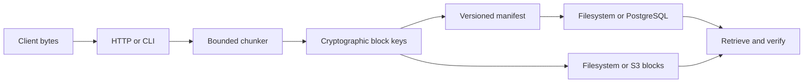

## Run the complete lifecycle

```bash
./scripts/verify-local-lifecycle.sh
```

The verification script ingests a file, starts fresh CLI JVMs for metadata, retrieval, and verification, and compares the retrieved bytes with the original. It prints the stable content ID and filesystem root for inspection.

For the HTTP service:

```bash
GRAVITON_BLOB_BACKEND=fs \
GRAVITON_FS_ROOT=/tmp/graviton-data \
GRAVITON_HTTP_PORT=8081 \
./sbt "server/run"
```

Then open [Connect Your Server](./demo.md). The console does not contain a sample dataset or a browser simulation. If it cannot reach the configured server, it shows the connection failure.

## Operational proof

Select a capability to inspect the repository evidence and executable command behind it.

<EvidenceHud />

## Interactive content lab

The public site has no hosted Graviton backend. This worksheet stays useful by performing real UTF-8 encoding, fixed chunking, SHA-256 hashing, content-ID formatting, and repeated-block detection in your browser.

<PipelinePlayground />

[Open the full CAS Playground](./cas-playground.md) for guided experiments and runtime boundaries.

## What is operational

| Path | Proof |
| --- | --- |
| Filesystem blocks and manifests | Restart-safe round-trip and inventory tests in `FsBlobManifestRepoSpec` |
| CLI ingest, stat, get, verify, and delete | `scripts/verify-local-lifecycle.sh` uses separate JVM invocations |
| HTTP upload, inventory, manifest, verify, download, HEAD, and delete | Contract coverage in `HttpApiSpec` |
| Browser operations console | Compiled Scala.js client calls the same HTTP routes directly |
| S3-compatible blocks and PostgreSQL manifests | Container-backed integration suites in CI |
| RocksDB key-value adapter | Close and reopen persistence test |

## Storage flow



## Explicit limits

Graviton is pre-1.0. Authentication assembly, range reads, distributed placement and repair, retention and garbage collection, and published benchmark envelopes remain open work. The documentation does not replace those gaps with modeled numbers or fictional status data.

## Continue

<div class="grid-container">
  <a href="guide/run-locally" class="feature-card">
    <h3>Run locally</h3>
    <p>Start the filesystem server and exercise every live endpoint.</p>
  </a>
  <a href="cas-playground" class="feature-card">
    <h3>CAS Playground</h3>
    <p>Hash and chunk your own bytes locally with real SHA-256 content IDs.</p>
  </a>
  <a href="pipeline-explorer" class="feature-card">
    <h3>Pipeline Explorer</h3>
    <p>Map the interactive byte flow to Graviton's executable transducers.</p>
  </a>
  <a href="demo" class="feature-card">
    <h3>Connect your server</h3>
    <p>Operate a Graviton HTTP endpoint that you provide.</p>
  </a>
  <a href="api/http" class="feature-card">
    <h3>HTTP contract</h3>
    <p>Use the operational blob API from curl or another client.</p>
  </a>
  <a href="architecture" class="feature-card">
    <h3>Architecture</h3>
    <p>Understand storage, streaming, and backend boundaries.</p>
  </a>
</div>

<style>
.grid-container {
  display: grid;
  grid-template-columns: repeat(auto-fit, minmax(250px, 1fr));
  gap: 1.5rem;
  margin-top: 2rem;
}

.feature-card {
  padding: 1.5rem;
  border: 1px solid var(--vp-c-brand-soft);
  border-radius: 12px;
  background: rgba(0, 255, 65, 0.03);
  transition: border-color 0.2s ease, transform 0.2s ease;
  text-decoration: none !important;
}

.feature-card:hover {
  border-color: var(--vp-c-brand-1);
  transform: translateY(-2px);
}

.feature-card h3 {
  color: var(--vp-c-brand-1);
  margin-top: 0;
}
</style>
