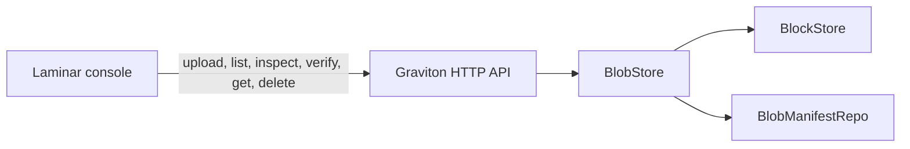

# Scala.js Operations Console

`modules/frontend` delivers the Laminar application mounted on the `/demo` page. It consumes shared protocol models and operates the same HTTP API used by command-line clients. The separate CAS Playground links the `graviton-shared` Scala.js artifact directly and does not depend on the Laminar console.

## Build and run

```bash
./sbt buildContentLab buildFrontend
./sbt 'server/run'
```

In another terminal:

```bash
npm ci --prefix docs
npm run docs:dev --prefix docs
```

Open `http://localhost:5173/demo`.

`buildFrontend` writes the Laminar console to `docs/public/js/`. `buildContentLab` links the shared bounded content analyzer into `docs/public/content-lab/`. VitePress loads each ES module only on the page that needs it.

## Data path


```mermaid
flowchart LR
  Browser[Laminar console]
  API[Graviton HTTP API]
  Store[BlobStore]
  Blocks[BlockStore]
  Manifests[BlobManifestRepo]

  Browser -->|upload, list, inspect, verify, get, delete| API
  API --> Store
  Store --> Blocks
  Store --> Manifests
```

The operations view reads server health, process counters, and durable inventory. Upload sends the selected file bytes without preprocessing. Inventory reads persisted manifests and exposes their exact block content IDs, offsets, and sizes. Verify causes the server to read and hash the stored bytes.

There is no browser-side storage engine, generated telemetry, fallback dataset, or inferred success state. A failed request is rendered as a failed request.

## Endpoint selection

The console resolves the server URL from:

1. the `api` query parameter
2. browser local storage
3. the `graviton-api-url` meta element
4. `http://localhost:8081`

The connection bar lets an operator change and persist the endpoint. Reloading begins a new set of live requests.

## Entry points

- `Main.scala` resolves the endpoint and mounts Laminar after the DOM is ready.
- `GravitonApp.scala` owns routing and top-level request state.
- `GravitonApi.scala` decodes typed HTTP responses and does not substitute data.
- `BrowserHttpClient.scala` sends JSON requests and binary file uploads through Fetch.

## Validation

```bash
./sbt 'frontend/compile'
./sbt 'sharedProtocolJVM/test' 'sharedProtocolJS/test'
./sbt buildContentLab buildFrontend
./scripts/verify-http-lifecycle.sh
npm run docs:build --prefix docs
```

Browser QA should cover the full lifecycle and a narrow viewport. The network panel should show each corresponding API request, and stopping the server should produce a visible connection failure.
