# Scala.js Frontend

`modules/frontend` delivers the Laminar-based dashboard that powers the `/demo` page. It cross-compiles alongside the JVM codebase, reuses shared protocol models, and emits a bundle that VitePress loads on demand.

:::tip Need a step-by-step loop?
See the new [Scala.js Playbook](../dev/scalajs.md) for incremental builds, hot reload, and bundling cheatsheets.
:::

## Quick Start

```bash
# One-off build
sbt buildFrontend

# Continuous development loop
sbt ~frontend/fastLinkJS

# Serve docs with the embedded demo
cd docs && npm run docs:dev
```

- `buildFrontend` writes an optimized bundle to `docs/public/js/main.js` (used for CI and production docs).
- `fastLinkJS` keeps source maps and rebuilds in milliseconds; symlink its output into `docs/public/js/main.js` for local iteration.
- VitePress (`docs`) dynamically imports `/js/main.js` whenever `/demo` is visited.

## Architecture

```mermaid
flowchart LR
  classDef layer fill:#e0f2fe,stroke:#0369a1,color:#0c4a6e;
  classDef shared fill:#fdf2f8,stroke:#be185d,color:#701a34;
  classDef runtime fill:#fef3c7,stroke:#b45309,color:#78350f;

  laminar["Laminar Components"]:::layer
  sharedJS["Shared Models (JS)"]:::shared
  sharedJVM["Shared Models (JVM)"]:::shared
  app["GravitonApp"]:::layer
  router["Laminar Router<br/>(Waypoint)"]:::layer
  pages["Bundled Views:<br/>Dashboard · Explorer · Upload · Stats · Schema"]:::layer
  api["GravitonApi<br/>(ZIO HTTP client)"]:::runtime

  sharedJS --> app
  sharedJVM --> app
  laminar --> app
  app --> router
  router --> pages
  app --> pages
  api --> app
```



### Bundled Views

- **Dashboard** - Animated overview with quick links into each tool.
- **Explorer** - Blob metadata and manifest inspector with demo fallback data.
- **Upload** - Client-side chunking sandbox visualising FastCDC behaviour.
- **Stats** - Aggregated counters pulled through ZIO calls to the API.
- **Schema** - Schema explorer that renders shared models and sample JSON directly in Scala.js.
- **Demo Boost Lab** - New control surface that lets you simulate ingest bursts, tune concurrency, and watch live activity events without running a real cluster.

### Entry Points

- `graviton/frontend/Main.scala` - bootstraps the Laminar tree once the DOM is ready and reads the `<meta name="graviton-api-url" />` configuration.
- `graviton/frontend/GravitonApp.scala` - orchestrates layout, navigation, and top-level state wiring.

### State & Effects

- **Signals**: Laminar `Signal`/`EventStream` instances drive reactive updates; each component is a pure `HtmlElement` factory.
- **API**: `GravitonApi` wraps `BrowserHttpClient` (Fetch) and exposes an `offlineSignal` used to toggle demo mode badges.
- **Demo data**: `DemoData` mirrors real API payloads and keeps the UI functional without a server. HTTP failures transparently swap to the canned dataset.

## Styling & Assets

- Shared CSS lives in `docs/.vitepress/theme/custom.css`. The Scala.js components emit semantic class names (`app-header`, `stats-panel`, ...); the docs theme now ships the matching rules.
- When adding new classes, extend `custom.css` rather than embedding `<style>` blocks in markdown.
- Static assets (icons, svgs) belong in `docs/public/` so VitePress can serve them alongside the bundle.

## Adding a New View

1. Create a component under `graviton/frontend/components/YourFeature.scala` that returns a Laminar `HtmlElement`.
2. Register a new `Route` in `GravitonApp` and add it to the navigation model.
3. Provide supporting API calls through `GravitonApi` (ideally typed with shared protocol models).
4. Update `docs/demo.md` copy if the UX needs new descriptions or build steps.
5. Run `sbt ~frontend/fastLinkJS` while hacking; finish with `sbt buildFrontend` before committing.

## Interop with the Docs Site

- The `/demo` markdown page injects the bundle and hosts the Laminar root node (`#graviton-app`).
- Vue components under `.vitepress/theme/components/` (e.g., `NeonHud`, `QuantumConsole`) can coexist with Scala.js output - they live outside the Laminar mount point.
- When adjusting the documentation layout, prefer editing CSS in `custom.css` to keep the Scala.js DOM stable.

## Testing & Quality

- Run the repo-wide `TESTCONTAINERS=0 ./sbt scalafmtAll test` to cover both JVM and JS targets before pushing.
- Component logic is organised so you can unit-test pure functions in JVM or JS scopes (e.g. shared utilities in `modules/protocol`).
- For browser regression checks, open DevTools and watch for console warnings emitted by Laminar or Fetch error handlers.

The frontend module intentionally avoids global state. Everything flows through Laminar signals and ZIO effects, which keeps the code portable and ready for future UIs beyond the documentation site.
