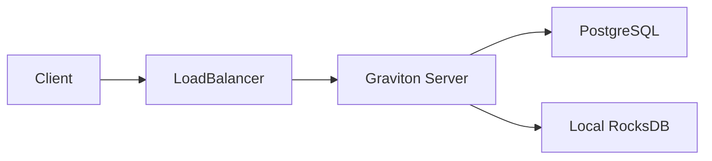
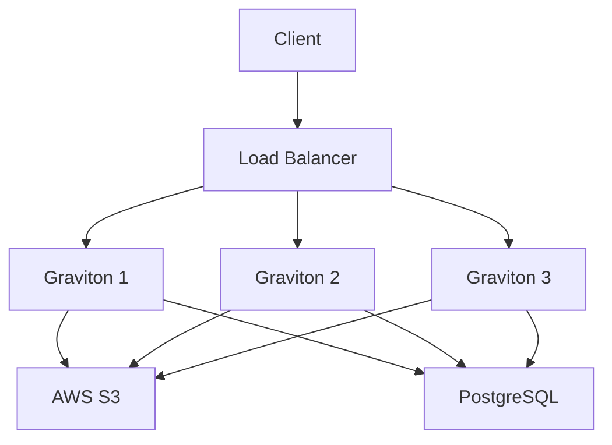
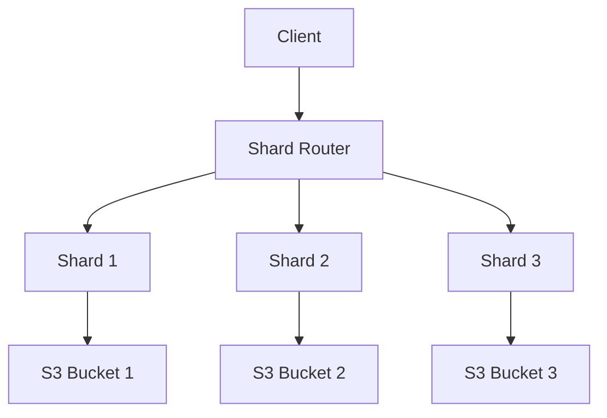

# Deployment Guide

Production deployment strategies for Graviton.

## Deployment Topologies

### Single Node

Simplest setup for development or small deployments:



**Pros:**
- Simple to manage
- Low latency
- Easy debugging

**Cons:**
- Single point of failure
- Limited scalability
- No geographic distribution

### Multi-Node with Shared Storage

Scale compute separately from storage:



**Pros:**
- Horizontal scalability
- High availability
- Simple failover

**Cons:**
- Network latency to shared storage
- Shared database can be bottleneck

### Sharded Architecture

Partition data across nodes:



**Pros:**
- Massive scalability
- Fault isolation
- Parallel processing

**Cons:**
- Complex routing
- Cross-shard operations harder
- More operational overhead

## Infrastructure

### Docker Compose

Development and small production:

```yaml
version: '3.8'

services:
  graviton:
    image: graviton:latest
    ports:
      - "8080:8080"
      - "50051:50051"
    environment:
      - PG_JDBC_URL=jdbc:postgresql://postgres:5432/graviton
      - PG_USERNAME=graviton
      - PG_PASSWORD=${PG_PASSWORD}
      - AWS_ACCESS_KEY_ID=${AWS_ACCESS_KEY_ID}
      - AWS_SECRET_ACCESS_KEY=${AWS_SECRET_ACCESS_KEY}
    volumes:
      - graviton-data:/var/lib/graviton
    depends_on:
      - postgres
    restart: unless-stopped

  postgres:
    image: postgres:16
    environment:
      - POSTGRES_DB=graviton
      - POSTGRES_USER=graviton
      - POSTGRES_PASSWORD=${PG_PASSWORD}
    volumes:
      - postgres-data:/var/lib/postgresql/data
    restart: unless-stopped

  prometheus:
    image: prom/prometheus:latest
    ports:
      - "9090:9090"
    volumes:
      - ./prometheus.yml:/etc/prometheus/prometheus.yml
      - prometheus-data:/prometheus
    restart: unless-stopped

volumes:
  graviton-data:
  postgres-data:
  prometheus-data:
```

### Kubernetes

Production-grade deployment:

```yaml
apiVersion: apps/v1
kind: Deployment
metadata:
  name: graviton
  labels:
    app: graviton
spec:
  replicas: 3
  selector:
    matchLabels:
      app: graviton
  template:
    metadata:
      labels:
        app: graviton
    spec:
      containers:
      - name: graviton
        image: graviton:0.1.0
        ports:
        - containerPort: 8080
          name: http
        - containerPort: 50051
          name: grpc
        env:
        - name: PG_JDBC_URL
          valueFrom:
            secretKeyRef:
              name: graviton-secrets
              key: pg-jdbc-url
        - name: PG_USERNAME
          valueFrom:
            secretKeyRef:
              name: graviton-secrets
              key: pg-username
        - name: PG_PASSWORD
          valueFrom:
            secretKeyRef:
              name: graviton-secrets
              key: pg-password
        - name: AWS_ACCESS_KEY_ID
          valueFrom:
            secretKeyRef:
              name: aws-credentials
              key: access-key-id
        - name: AWS_SECRET_ACCESS_KEY
          valueFrom:
            secretKeyRef:
              name: aws-credentials
              key: secret-access-key
        resources:
          requests:
            memory: "2Gi"
            cpu: "1000m"
          limits:
            memory: "4Gi"
            cpu: "2000m"
        livenessProbe:
          httpGet:
            path: /health
            port: 8080
          initialDelaySeconds: 30
          periodSeconds: 10
        readinessProbe:
          httpGet:
            path: /health
            port: 8080
          initialDelaySeconds: 10
          periodSeconds: 5
        volumeMounts:
        - name: data
          mountPath: /var/lib/graviton
      volumes:
      - name: data
        persistentVolumeClaim:
          claimName: graviton-pvc
---
apiVersion: v1
kind: Service
metadata:
  name: graviton
spec:
  selector:
    app: graviton
  ports:
  - name: http
    port: 80
    targetPort: 8080
  - name: grpc
    port: 50051
    targetPort: 50051
  type: LoadBalancer
---
apiVersion: v1
kind: PersistentVolumeClaim
metadata:
  name: graviton-pvc
spec:
  accessModes:
    - ReadWriteOnce
  resources:
    requests:
      storage: 100Gi
```

## Configuration

### Production Config

```hocon
graviton {
  server {
    http {
      host = "0.0.0.0"
      port = 8080
      request-timeout = 30s
      max-request-size = 100MB
    }
    
    grpc {
      host = "0.0.0.0"
      port = 50051
      max-message-size = 100MB
      keepalive-time = 30s
    }
  }
  
  storage {
    backend = "s3"
    
    s3 {
      bucket = ${GRAVITON_S3_BUCKET}
      region = ${AWS_REGION}
      multipart {
        part-size = 5MB
        max-parts = 10000
      }
    }
  }
  
  replication {
    factor = 3
    strategy = "zone-aware"
    min-zones = 2
    
    repair {
      enabled = true
      interval = 5m
      parallel-jobs = 4
    }
  }
  
  constraints {
    max-blob-size = 100GB
    max-concurrent-uploads = 100
    rate-limit {
      bytes-per-second = 100MB
      burst-size = 500MB
    }
  }
  
  metrics {
    enabled = true
    prometheus-port = 9090
  }
  
  logging {
    level = "INFO"
    format = "json"
    correlation-id-header = "X-Request-ID"
  }
}
```

### Environment Variables

```bash
# Database
export PG_JDBC_URL="jdbc:postgresql://postgres.example.com:5432/graviton"
export PG_USERNAME="graviton"
export PG_PASSWORD="secure-password"

# S3
export AWS_ACCESS_KEY_ID="AKIA..."
export AWS_SECRET_ACCESS_KEY="..."
export GRAVITON_S3_BUCKET="graviton-prod"
export AWS_REGION="us-east-1"

# JVM
export JAVA_OPTS="-Xmx4g -Xms2g -XX:+UseG1GC -XX:MaxGCPauseMillis=200"

# Application
export GRAVITON_ENV="production"
export GRAVITON_LOG_LEVEL="INFO"
```

## Monitoring

### Prometheus

`prometheus.yml`:
```yaml
global:
  scrape_interval: 15s

scrape_configs:
  - job_name: 'graviton'
    static_configs:
      - targets: ['graviton:8080']
    metrics_path: '/metrics'
```

### Grafana Dashboard

Key metrics to monitor:

- **Upload rate** (`graviton_uploads_total`)
- **Download rate** (`graviton_downloads_total`)
- **Storage usage** (`graviton_storage_bytes`)
- **Replication health** (`graviton_replicas_unhealthy`)
- **Error rate** (`graviton_errors_total`)
- **Latency** (`graviton_request_duration_seconds`)

### Alerts

```yaml
groups:
  - name: graviton
    rules:
      - alert: HighErrorRate
        expr: rate(graviton_errors_total[5m]) > 0.05
        for: 5m
        labels:
          severity: warning
        annotations:
          summary: "High error rate detected"
          
      - alert: LowReplicationHealth
        expr: graviton_replicas_unhealthy > 10
        for: 10m
        labels:
          severity: critical
        annotations:
          summary: "Many unhealthy replicas"
          
      - alert: DiskSpacelow
        expr: graviton_storage_bytes / graviton_storage_capacity > 0.9
        for: 5m
        labels:
          severity: warning
        annotations:
          summary: "Storage nearly full"
```

## Backup & Recovery

### Database Backup

```bash
#!/bin/bash
# backup-postgres.sh

DATE=$(date +%Y%m%d_%H%M%S)
BACKUP_FILE="graviton_backup_$DATE.sql.gz"

pg_dump -h postgres.example.com -U graviton graviton | gzip > $BACKUP_FILE

# Upload to S3
aws s3 cp $BACKUP_FILE s3://graviton-backups/postgres/

# Keep last 30 days
find . -name "graviton_backup_*.sql.gz" -mtime +30 -delete
```

### Blob Backup

Blobs in S3 are already durable, but enable versioning:

```bash
aws s3api put-bucket-versioning \
  --bucket graviton-prod \
  --versioning-configuration Status=Enabled

# Enable cross-region replication
aws s3api put-bucket-replication \
  --bucket graviton-prod \
  --replication-configuration file://replication.json
```

## Security

### TLS Configuration

```hocon
graviton {
  server {
    http {
      tls {
        enabled = true
        cert-file = "/etc/graviton/tls/cert.pem"
        key-file = "/etc/graviton/tls/key.pem"
      }
    }
    
    grpc {
      tls {
        enabled = true
        cert-chain-file = "/etc/graviton/tls/cert.pem"
        private-key-file = "/etc/graviton/tls/key.pem"
        trust-cert-collection-file = "/etc/graviton/tls/ca.pem"
      }
    }
  }
}
```

### Authentication

JWT configuration:

```hocon
graviton {
  auth {
    enabled = true
    jwt {
      issuer = "https://auth.example.com"
      audience = "graviton-api"
      jwks-url = "https://auth.example.com/.well-known/jwks.json"
    }
  }
}
```

### Network Policies

Kubernetes network policy:

```yaml
apiVersion: networking.k8s.io/v1
kind: NetworkPolicy
metadata:
  name: graviton-policy
spec:
  podSelector:
    matchLabels:
      app: graviton
  policyTypes:
  - Ingress
  - Egress
  ingress:
  - from:
    - podSelector:
        matchLabels:
          role: frontend
    ports:
    - protocol: TCP
      port: 8080
    - protocol: TCP
      port: 50051
  egress:
  - to:
    - podSelector:
        matchLabels:
          app: postgres
    ports:
    - protocol: TCP
      port: 5432
```

## Scaling

### Horizontal Scaling

Add more pods:

```bash
kubectl scale deployment graviton --replicas=5
```

### Vertical Scaling

Increase resources:

```bash
kubectl set resources deployment graviton \
  --requests=cpu=2,memory=4Gi \
  --limits=cpu=4,memory=8Gi
```

### Auto-scaling

```yaml
apiVersion: autoscaling/v2
kind: HorizontalPodAutoscaler
metadata:
  name: graviton-hpa
spec:
  scaleTargetRef:
    apiVersion: apps/v1
    kind: Deployment
    name: graviton
  minReplicas: 3
  maxReplicas: 10
  metrics:
  - type: Resource
    resource:
      name: cpu
      target:
        type: Utilization
        averageUtilization: 70
  - type: Resource
    resource:
      name: memory
      target:
        type: Utilization
        averageUtilization: 80
```

## See Also

- **[Performance Tuning](./performance.md)** — Optimization strategies
- **[Backends](../runtime/backends.md)** — Storage configuration
- **[Installation](../guide/installation.md)** — Setup guide

::: warning
Always test your deployment in a staging environment first!
:::
