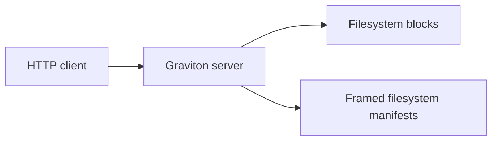
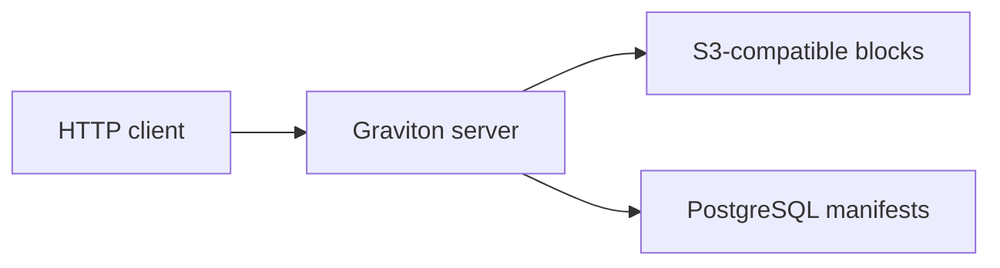

# Deployment Readiness

Graviton is operational for local evaluation, but it is not production-ready. This page documents the two server compositions that exist today and the gates that still prevent a production recommendation.

## Current server compositions


```mermaid
flowchart LR
    client[HTTP client] --> server[Graviton server]
    server --> fsBlocks[Filesystem blocks]
    server --> fsManifests[Framed filesystem manifests]
```

The default `fs` composition is self-contained and restart-safe. It is the right path for a local demo, development, and single-host evaluation.


```mermaid
flowchart LR
    client[HTTP client] --> server[Graviton server]
    server --> s3[S3-compatible blocks]
    server --> pg[PostgreSQL manifests]
```

The `s3` and `minio` compositions share blocks through object storage and manifests through PostgreSQL. Their adapters have container-gated integration coverage, but that does not establish high availability, safe rolling upgrades, or a production support boundary.

## Start a controlled evaluation

Filesystem mode needs no external service:

```bash
export GRAVITON_BLOB_BACKEND="fs"
export GRAVITON_FS_ROOT="/var/lib/graviton"
export GRAVITON_FS_BLOCK_PREFIX="cas/blocks"
export GRAVITON_HTTP_PORT="8081"

./sbt "server/run"
```

The process should have read and write access only to its storage root. Back up both `cas/blocks/` and `cas/manifests/` together. Logical deletion removes a manifest but intentionally retains blocks for deduplication, and garbage collection is not implemented yet.

For S3/MinIO mode, follow [Run Locally](../guide/run-locally.md) and [Configuration Reference](../guide/configuration-reference.md). PostgreSQL is required only for that composition or for the optional JDBC audit sink.

## Health and observability

| Endpoint | Current meaning |
| --- | --- |
| `GET /api/health` | The HTTP process is running |
| `GET /api/stats` | Process-local successful-ingest and dedup counters |
| `GET /metrics` | The same evolving runtime counters in Prometheus text format |

A successful health response does not prove that every object is readable or that a remote backend is healthy. Counters reset on restart and do not include request-latency histograms, durable capacity, replication health, or backend service levels.

Implemented ingest counter names include:

- `graviton_blob_ingests_total`
- `graviton_bytes_ingested_total`
- `graviton_fresh_blocks_total`
- `graviton_duplicate_blocks_total`

## Security boundary

Security is disabled by default, and the server logs a warning. Do not expose the default listener to an untrusted network.

The repository includes authentication middleware, an HS256 development-token flow, audit sinks, and typed security configuration. A live non-development OIDC verifier is not wired into `Main`; when security is enabled without the development secret, the current assembly denies requests. TLS termination, production key management, CORS enforcement, rate-limit enforcement, and a completed threat-model review remain release gates.

## Packaging boundary

The repository does not currently publish a supported container image, Kubernetes manifest, service unit, or stable server artifact. Build and deployment automation must not invent an image tag or jar path.

Before adding packaging, first choose and test:

1. a reproducible server artifact
2. a non-root runtime user and writable data path
3. graceful shutdown behavior during in-flight uploads
4. readiness checks that exercise the selected backend
5. resource limits derived from measured workloads
6. secret delivery that does not expose values in logs or process arguments
7. an upgrade and rollback process for both manifest formats

## Production gates

Do not call a deployment production-ready until these are complete:

- stable, versioned HTTP contracts and error codes
- real OIDC/JWKS verification and authorization policy
- TLS and proxy trust boundaries
- request-size and rate-limit enforcement
- crash and power-loss testing for durable backends
- migration and compatibility policies for framed and PostgreSQL manifests
- external artifact-consumer and packaging checks
- backup and restore drills with byte-for-byte verification
- garbage collection with dry-run and recovery controls
- multi-process and rolling-upgrade acceptance tests
- a reproducible performance harness with environment provenance

The root `ROADMAP.md` and `TODO.md` files keep these gaps explicit.

## See also

- [Run Locally](../guide/run-locally.md)
- [Configuration Reference](../guide/configuration-reference.md)
- [Storage Backends](../guide/storage-backends.md)
- [Performance Measurement](./performance.md)
