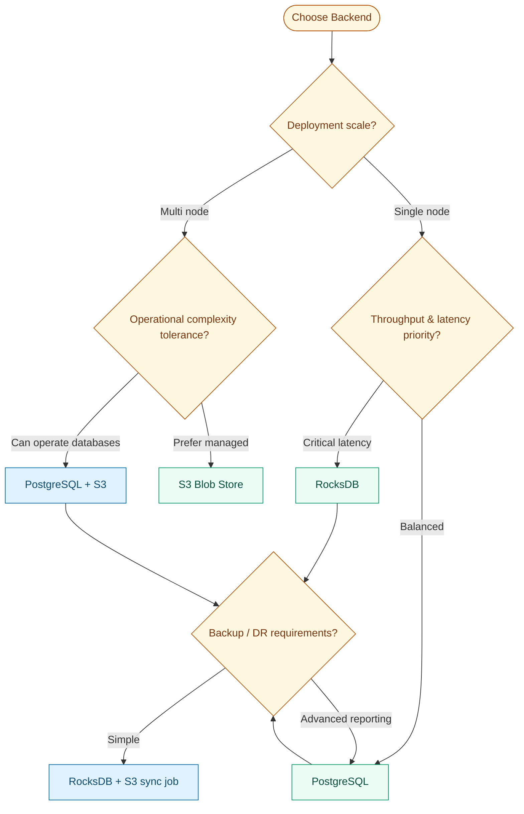

# Storage Backends

Graviton supports multiple backend implementations for flexibility in deployment and cost optimization.

## Available Backends

### PostgreSQL (`graviton-pg`)

Full-featured backend with ACID guarantees.

#### Features

- ✅ ACID transactions
- ✅ Complex queries on metadata
- ✅ Built-in replication (streaming replication)
- ✅ Point-in-time recovery
- ✅ JSON/JSONB for flexible attributes
- ⚠️ Limited to single-server scale (with read replicas)

#### Configuration

```hocon
graviton {
  backend = "postgres"
  
  postgres {
    url = "jdbc:postgresql://localhost:5432/graviton"
    username = "graviton"
    password = ${GRAVITON_PG_PASSWORD}
    
    pool {
      min-size = 5
      max-size = 20
      connection-timeout = 30s
    }
    
    # Store blobs in PostgreSQL or reference external storage
    blob-storage = "pg"  # or "s3" for hybrid mode
    
    # Large object vs bytea
    use-large-objects = true  # For blobs > 1MB
  }
}
```

#### Schema

```sql
-- Core tables
CREATE TABLE blobs (
  key BYTEA PRIMARY KEY,
  size BIGINT NOT NULL,
  created_at TIMESTAMPTZ NOT NULL DEFAULT NOW(),
  content_type TEXT,
  attributes JSONB
);

CREATE TABLE blob_data (
  key BYTEA REFERENCES blobs(key) ON DELETE CASCADE,
  chunk_offset BIGINT NOT NULL,
  chunk_data BYTEA NOT NULL,
  PRIMARY KEY (key, chunk_offset)
);

CREATE TABLE manifests (
  key BYTEA PRIMARY KEY REFERENCES blobs(key),
  manifest_data BYTEA NOT NULL,
  version INT NOT NULL DEFAULT 1
);

CREATE TABLE replicas (
  key BYTEA REFERENCES blobs(key),
  sector_id TEXT NOT NULL,
  range_start BIGINT NOT NULL,
  range_end BIGINT NOT NULL,
  healthy BOOLEAN NOT NULL DEFAULT TRUE,
  last_verified TIMESTAMPTZ,
  PRIMARY KEY (key, sector_id, range_start)
);

-- Indexes for common queries
CREATE INDEX idx_blobs_created ON blobs(created_at);
CREATE INDEX idx_blobs_content_type ON blobs(content_type);
CREATE INDEX idx_replicas_sector ON replicas(sector_id);
CREATE INDEX idx_replicas_healthy ON replicas(healthy) WHERE NOT healthy;
```

#### Implementation

```scala
final class PostgresBlobStore(
  pool: ConnectionPool,
  config: PostgresConfig
) extends MutableObjectStore:
  
  def put(key: BinaryKey, data: Chunk[Byte]): IO[StorageError, Unit] =
    pool.transaction { conn =>
      for {
        _ <- insertBlob(conn, key, data.size)
        _ <- if config.useLargeObjects then
          insertAsLargeObject(conn, key, data)
        else
          insertAsBytea(conn, key, data)
      } yield ()
    }
  
  def get(key: BinaryKey): IO[StorageError, Chunk[Byte]] =
    pool.withConnection { conn =>
      for {
        exists <- blobExists(conn, key)
        _ <- ZIO.when(!exists)(ZIO.fail(StorageError.NotFound(key)))
        data <- if config.useLargeObjects then
          retrieveLargeObject(conn, key)
        else
          retrieveBytea(conn, key)
      } yield data
    }
  
  // Multipart support via chunked inserts
  def uploadPart(
    uploadId: UploadId,
    partNumber: Int,
    data: Chunk[Byte]
  ): IO[StorageError, PartETag] =
    pool.transaction { conn =>
      sql"""
        INSERT INTO blob_data (key, chunk_offset, chunk_data)
        VALUES (${uploadId.key}, ${partNumber * chunkSize}, ${data.toArray})
      """.update.run(conn).as(PartETag(partNumber, computeETag(data)))
    }
```

### AWS S3 (`graviton-s3`)

Scalable object storage.

#### Features

- ✅ Infinite scalability
- ✅ Built-in durability (99.999999999%)
- ✅ Native multipart upload
- ✅ Lifecycle policies
- ✅ Cross-region replication
- ⚠️ Eventually consistent (in some regions)
- ⚠️ Higher latency than local storage

#### Configuration

```hocon
graviton {
  backend = "s3"
  
  s3 {
    bucket = "graviton-blobs"
    region = "us-east-1"
    
    # Credentials (uses default AWS SDK chain)
    # Can also set via env vars or IAM roles
    access-key-id = ${?AWS_ACCESS_KEY_ID}
    secret-access-key = ${?AWS_SECRET_ACCESS_KEY}
    
    # For MinIO or S3-compatible storage
    endpoint = ${?S3_ENDPOINT}
    path-style-access = false
    
    # Multipart upload settings
    multipart {
      part-size = 5MB  # Minimum 5MB per AWS docs
      max-parts = 10000
      upload-timeout = 1h
    }
    
    # Prefix strategy
    key-prefix = "blobs/"
    
    # Storage class
    storage-class = "STANDARD"  # or "STANDARD_IA", "GLACIER", etc.
  }
}
```

#### Implementation

```scala
final class S3BlobStore(
  client: S3AsyncClient,
  config: S3Config
) extends MutableObjectStore:
  
  def put(key: BinaryKey, data: Chunk[Byte]): IO[StorageError, Unit] =
    if data.size < config.multipart.partSize then
      // Single-part upload
      val request = PutObjectRequest.builder()
        .bucket(config.bucket)
        .key(objectKey(key))
        .build()
      
      ZIO.fromCompletableFuture(
        client.putObject(request, AsyncRequestBody.fromBytes(data.toArray))
      ).mapError(S3Error.wrap)
    else
      // Multipart upload
      multipartUpload(key, data)
  
  def startMultipart(key: BinaryKey): IO[StorageError, UploadId] =
    val request = CreateMultipartUploadRequest.builder()
      .bucket(config.bucket)
      .key(objectKey(key))
      .build()
    
    ZIO.fromCompletableFuture(client.createMultipartUpload(request))
      .map(resp => UploadId(resp.uploadId()))
      .mapError(S3Error.wrap)
  
  def uploadPart(
    uploadId: UploadId,
    partNumber: Int,
    data: Chunk[Byte]
  ): IO[StorageError, PartETag] =
    val request = UploadPartRequest.builder()
      .bucket(config.bucket)
      .key(objectKey(uploadId.key))
      .uploadId(uploadId.value)
      .partNumber(partNumber)
      .build()
    
    ZIO.fromCompletableFuture(
      client.uploadPart(request, AsyncRequestBody.fromBytes(data.toArray))
    ).map(resp => PartETag(partNumber, resp.eTag()))
      .mapError(S3Error.wrap)
  
  private def objectKey(key: BinaryKey): String =
    s"${config.keyPrefix}${key.hex}"
```

### RocksDB (`graviton-rocks`)

Embedded key-value store.

#### Features

- ✅ Very fast (local SSD)
- ✅ Embedded (no separate process)
- ✅ ACID-like semantics
- ✅ Built-in compression
- ✅ Low latency
- ⚠️ Single-node only
- ⚠️ Manual backup/replication needed

#### Configuration

```hocon
graviton {
  backend = "rocksdb"
  
  rocksdb {
    path = "/var/lib/graviton/rocksdb"
    
    # Performance tuning
    max-open-files = 1000
    write-buffer-size = 64MB
    max-write-buffer-number = 3
    
    # Compression
    compression = "lz4"  # or "snappy", "zstd", "none"
    
    # Block cache
    block-cache-size = 256MB
    
    # Bloom filters
    bloom-filter-bits-per-key = 10
    
    # Compaction
    max-background-jobs = 4
    level0-file-num-compaction-trigger = 4
  }
}
```

#### Implementation

```scala
final class RocksDBBlobStore(
  db: RocksDB,
  config: RocksDBConfig
) extends BlobStore:
  
  private val blobCF = db.getColumnFamilyHandle("blobs")
  private val manifestCF = db.getColumnFamilyHandle("manifests")
  
  def put(key: BinaryKey, data: Chunk[Byte]): IO[StorageError, Unit] =
    ZIO.attempt {
      db.put(blobCF, key.bytes, data.toArray)
    }.mapError(RocksDBError.wrap)
  
  def get(key: BinaryKey): IO[StorageError, Chunk[Byte]] =
    ZIO.attempt {
      val data = db.get(blobCF, key.bytes)
      if data == null then
        throw StorageError.NotFound(key)
      else
        Chunk.fromArray(data)
    }.mapError(RocksDBError.wrap)
  
  def exists(key: BinaryKey): IO[StorageError, Boolean] =
    ZIO.attempt {
      db.get(blobCF, key.bytes) != null
    }.mapError(RocksDBError.wrap)
  
  // Range reads
  def getRange(key: BinaryKey, range: Span): IO[StorageError, Chunk[Byte]] =
    ZIO.attempt {
      val full = db.get(blobCF, key.bytes)
      if full == null then
        throw StorageError.NotFound(key)
      else
        Chunk.fromArray(full.slice(range.offset.toInt, (range.offset + range.length).toInt))
    }.mapError(RocksDBError.wrap)
```

## Hybrid Architectures

### PostgreSQL + S3

Use PostgreSQL for metadata, S3 for blob data:

```scala
final class HybridBlobStore(
  pg: PostgresMetadataStore,
  s3: S3BlobStore
) extends BlobStore:
  
  def put(key: BinaryKey, data: Chunk[Byte]): IO[StorageError, Unit] =
    for {
      // Store blob in S3
      _ <- s3.put(key, data)
      
      // Store metadata in PostgreSQL
      _ <- pg.recordBlob(key, BlobMetadata(
        size = data.size,
        contentType = detectContentType(data),
        storageBackend = "s3"
      ))
    } yield ()
  
  def get(key: BinaryKey): IO[StorageError, Chunk[Byte]] =
    for {
      // Check metadata first
      meta <- pg.getMetadata(key)
      
      // Retrieve from appropriate backend
      data <- meta.storageBackend match
        case "s3" => s3.get(key)
        case "pg" => pg.getBlob(key)
        case _ => ZIO.fail(StorageError.UnknownBackend)
    } yield data
```

### Tiered Storage

Hot/warm/cold tiers:

```scala
final class TieredBlobStore(
  hot: RocksDBBlobStore,    // Local SSD
  warm: S3BlobStore,         // S3 Standard
  cold: GlacierBlobStore,    // S3 Glacier
  policy: TieringPolicy
) extends BlobStore:
  
  def get(key: BinaryKey): IO[StorageError, Chunk[Byte]] =
    // Try tiers in order
    hot.get(key)
      .orElse(warm.get(key).tap(data => hot.put(key, data)))  // Promote to hot
      .orElse(cold.get(key).tap(data => warm.put(key, data))) // Restore from cold
  
  def put(key: BinaryKey, data: Chunk[Byte]): IO[StorageError, Unit] =
    for {
      tier <- policy.selectTier(data.size, attributes)
      _ <- tier match
        case Tier.Hot => hot.put(key, data)
        case Tier.Warm => warm.put(key, data)
        case Tier.Cold => cold.put(key, data)
    } yield ()
```

## Performance Comparison

| Backend | Latency (p50) | Latency (p99) | Throughput | Cost |
|---------|---------------|---------------|------------|------|
| RocksDB | 0.1-1ms | 1-5ms | 500+ MB/s | Low (hardware) |
| PostgreSQL | 1-5ms | 10-50ms | 100-500 MB/s | Medium |
| S3 (same region) | 10-50ms | 100-200ms | 100-1000 MB/s | Low (storage) |
| S3 (cross-region) | 50-200ms | 200-500ms | 50-500 MB/s | Medium (transfer) |

## Choosing a Backend

### Decision Matrix



### Recommendations

**Development:**
- Use RocksDB for speed
- Or PostgreSQL for query flexibility

**Production (small scale):**
- PostgreSQL with streaming replication
- RocksDB + periodic S3 snapshots

**Production (large scale):**
- S3 for blob storage
- PostgreSQL for metadata
- RocksDB for hot cache

**Multi-region:**
- S3 with cross-region replication
- PostgreSQL with logical replication

## Migration

### Between Backends

```scala
def migrateBlobStore(
  source: BlobStore,
  target: BlobStore
): ZIO[Any, StorageError, Long] =
  source.list("").mapZIO { key =>
    for {
      data <- source.get(key)
      _ <- target.put(key, data)
      _ <- Console.printLine(s"Migrated $key")
    } yield 1L
  }.runSum

// Run migration
val migration = for {
  rocksDB <- ZIO.service[RocksDBBlobStore]
  s3 <- ZIO.service[S3BlobStore]
  count <- migrateBlobStore(rocksDB, s3)
  _ <- Console.printLine(s"Migrated $count blobs")
} yield ()
```

## See Also

- **[Ports & Policies](./ports.md)** — Service interfaces
- **[Deployment](../ops/deployment.md)** — Production setup
- **[Performance](../ops/performance.md)** — Tuning backends

::: tip
Start with PostgreSQL for simplicity, migrate to S3 when you need scale!
:::
