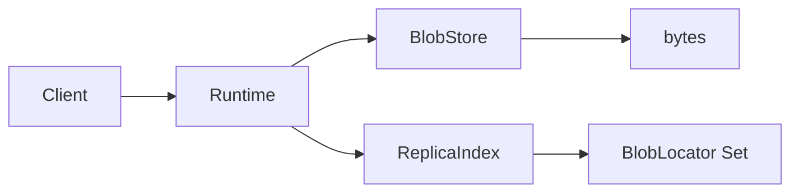

# Replication & Replica Index (Current Status)

Graviton’s long-term replication model is built around **locators** (where bytes live) and **content keys** (what the bytes are). The repository currently exposes a small but important building block: `ReplicaIndex`.

This page describes **what exists today**, and what is planned next.

## What exists today

### `ReplicaIndex`

The runtime defines:

- `replicas(key: BinaryKey): ZIO[Any, Throwable, Set[BlobLocator]]`
- `update(key: BinaryKey, locators: Set[BlobLocator]): ZIO[Any, Throwable, Unit]`

This is intentionally minimal: it answers *“where can I fetch this blob?”* without encoding sector topology, racks, quorum rules, or repair workflows yet.

### Current implementations

- **Postgres**: `PgReplicaIndex` exists, but is currently a stub (returns an empty set; updates are a no-op).

## How it fits into the architecture

- A **blob key** (`BinaryKey`) identifies content.
- A **locator** (`BlobLocator`) identifies where content is stored (scheme/bucket/path-style addressing).
- `ReplicaIndex` is the bridge that maps keys → locators.

## Roadmap (planned, not implemented yet)

The following concepts are useful for reasoning about replication, but they are **not** fully implemented in the current codebase:

- **Sectors / placement**: grouping locators into failure domains (disk/node/rack/zone).
- **Replication factor + quorum**: write policies (e.g., N=3, quorum=2) and read fallback ordering.
- **Repair + scrubbing**: background jobs that detect missing locators and rehydrate data.

When these land, this page should expand to cover:

1. How blob writes choose locators (policy)
2. How reads select replicas (preference + fallback)
3. How to run repair loops and observe health (metrics + logs)

## See also

- **[Runtime ports](./ports.md)** — where `ReplicaIndex` is defined
- **[Storage backends](./backends.md)** — which backends currently implement replica index hooks

