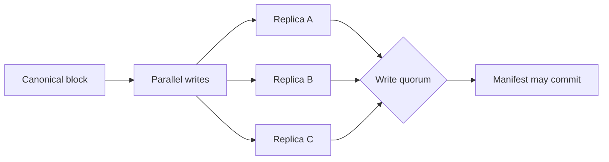

# Failure-domain durability and Replica Index

Graviton separates content identity from placement. `BinaryKey` answers what the bytes are; `BlobLocator` and `ReplicaIndex` answer where copies live.

## Replicated block store

`ReplicatedBlockStore` composes multiple `RepairableBlockStore` instances. Stable rendezvous hashing selects the desired target set for each content key and prefers distinct operator-declared failure domains before selecting a second target from the same domain.

```mermaid
flowchart LR
  ingest[Canonical block] --> fanout[Parallel writes]
  fanout --> a[Replica A]
  fanout --> b[Replica B]
  fanout --> c[Replica C]
  a --> quorum{Write quorum}
  b --> quorum
  c --> quorum
  quorum --> commit[Manifest may commit]
```

Writes run in parallel only across the selected targets and succeed only after the configured number report success. A failed quorum fails the block batch, so the logical manifest cannot report a completed blob. If `GRAVITON_REPLICATION_WRITE_QUORUM` is omitted, it defaults to the desired replica count rather than silently accepting one copy.

Reads try selected replicas sequentially, preferring the configured local failure domain, then fall back to other configured targets as migration sources when a topology expansion changes rendezvous placement. Each candidate is collected only under the compile-time 16 MiB block ceiling, then checked for exact byte count and digest before it is trusted. A missing or corrupt candidate falls through to the next replica. Earlier bad selected candidates are repaired from the validated bounded block without detached fibers.

`repair` validates every selected target sequentially, retaining at most the validated source and one bounded candidate, then atomically replaces missing or corrupt filesystem or S3 objects. The health check requires the configured write quorum.

## Fixed 2+1 erasure mode

`ErasureBlockStore` is the lower-overhead three-domain option. It splits each canonical block into two equal-length systematic shards, padding the final byte when needed, and computes one XOR parity shard. The three target names are sorted before shard indexes are assigned, so configuration order does not change physical placement. Target names must remain stable after data is written.

Any two shards reconstruct the original. A read validates each shard's length and SHA-256 object proof, reconstructs only when necessary, and then validates the complete result against the original block length and content digest. A background convergence pass regenerates any missing shard from two validated shards. Two target losses are not recoverable.

The codec is deliberately fixed rather than exposing unqualified Reed-Solomon knobs. For a maximum 16 MiB canonical block, each shard is at most 8 MiB. Encoding retains the 16 MiB source plus at most 24 MiB of shards. Reconstruction retains two 8 MiB source shards, one possible 8 MiB reconstructed shard, and the verified 16 MiB result. Synchronous S3 request bodies and convergence repair have separately documented conservative ceilings in [Performance](../ops/performance.md). Blob payloads remain streamed block by block and are never materialized.

## Scheduled repair

When `GRAVITON_REPLICATION_TARGETS` is non-empty, the packaged server starts one scoped `ReplicaRepairService`. Each cycle walks manifest summaries and block references as streams, resumes from a durable offset, and processes at most the Iron-refined batch limit. Filesystem deployments persist the offset below `cas/repair`; shared deployments use PostgreSQL. Per-block failures update a bounded durable dead-letter record and are retried on a later cycle. A successful convergence resolves that entry. Enumeration or journal failures fail the cycle and are logged before the schedule continues.

Prometheus observations include placement decisions, local and remote reads, per-target writes, erasure reconstruction, repair attempts, cycle duration, cursor, last successful convergence, under-protected blocks, and healthy target count. Target names are configuration-bounded labels. Content IDs, tenants, and upload session IDs never become metric labels.

## PostgreSQL replica index

`PgReplicaIndex` transactionally persists locator sets for blob, block, chunk, manifest, and view keys in `graviton.replica_index`.

- `replicas(key)` reads the current locator set
- `update(key, locators)` replaces the set in one transaction
- an empty set removes all locators for the key
- locators are sorted before insertion for deterministic behavior

The embedded PostgreSQL integration suite writes two locators, reads them back, replaces the set, and verifies the persisted result.

## What is wired today

`ReplicatedBlockStore`, `ErasureBlockStore`, rendezvous `ReplicaPlacement`, `ReplicaRepairService`, and `PgReplicaIndex` are operational library surfaces with executable tests. The packaged server builds filesystem replica targets from independent roots or S3-compatible targets from independently configured endpoint contracts, applies the selected durability policy, and starts repair automatically.

The PostgreSQL replica index remains an application-facing locator catalog. The packaged repair worker derives desired placement directly from deterministic configuration and manifest keys, so correctness does not depend on an eventually updated index row.

## Operational rules

- choose replicas across real failure domains rather than multiple paths on one disk
- declare target failure domains truthfully; Graviton can spread labels but cannot prove racks, zones, accounts, or providers are independent
- set write quorum according to the durability contract, not just availability preference
- do not count a copy as healthy until its content key validates
- alert on failed repair cycles and targets; the worker retries but does not silently lower desired replica count
- coordinate replica-index updates with the application workflow that provisions or removes copies
- add new targets and let a complete repair scrub migrate every referenced block before removing an old target; a target removed from configuration cannot be used as a recovery source
- test full and partial outages using the actual backends and credentials

## Remaining boundaries

- the cursor is an offset into the current stable manifest order, so concurrent inventory mutation can defer work until wraparound; convergence remains idempotent
- PostgreSQL coordinates progress across nodes, but a worker that dies after repair and before checkpoint may replay already converged blocks
- dead letters are durable operational state and still require alerts, inspection, and remediation policy
- object-store accounts, regions, bucket policies, throttling, and correlated failures require target acceptance
- each exact mixed-version pair still requires the rolling and rollback qualification record
