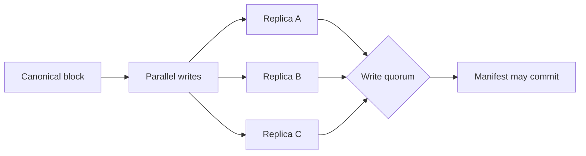

# Replication and Replica Index

Graviton separates content identity from placement. `BinaryKey` answers what the bytes are; `BlobLocator` and `ReplicaIndex` answer where copies live.

## Replicated block store

`ReplicatedBlockStore` composes multiple `BlockStore` instances with a write quorum.

```mermaid
flowchart LR
  ingest[Canonical block] --> fanout[Parallel writes]
  fanout --> a[Replica A]
  fanout --> b[Replica B]
  fanout --> c[Replica C]
  a --> quorum{Write quorum}
  b --> quorum
  c --> quorum
  quorum --> commit[Manifest may commit]
```

Writes run in parallel and succeed only after the configured number of replicas report success. A failed quorum fails the block batch, so the logical manifest cannot report a completed blob.

Reads try replicas in order. Each candidate is streamed through a digest and byte-count check before it is trusted. A missing or corrupt candidate falls through to the next replica. After a valid fallback read, missing replicas are repaired in the background from the validated bytes.

The API also exposes an explicit repair report and a health check that requires the configured read/write quorum.

## PostgreSQL replica index

`PgReplicaIndex` transactionally persists locator sets for blob, block, chunk, manifest, and view keys in `graviton.replica_index`.

- `replicas(key)` reads the current locator set
- `update(key, locators)` replaces the set in one transaction
- an empty set removes all locators for the key
- locators are sorted before insertion for deterministic behavior

The embedded PostgreSQL integration suite writes two locators, reads them back, replaces the set, and verifies the persisted result.

## What is wired today

`ReplicatedBlockStore` and `PgReplicaIndex` are operational library surfaces with executable tests. The default packaged server selects one filesystem or S3 block adapter. It does not yet build topology, placement, or repair schedules from configuration.

Applications can compose the replicated store directly when they control placement and lifecycle. Server-level automatic scheduling remains a 0.2 task.

## Operational rules

- choose replicas across real failure domains rather than multiple paths on one disk
- set write quorum according to the durability contract, not just availability preference
- do not count a copy as healthy until its content key validates
- retain repair failures as observable work instead of silently lowering the desired replica count
- coordinate replica-index updates with the application workflow that provisions or removes copies
- test full and partial outages using the actual backends and credentials

## Remaining work

- server configuration for replica topology and quorum
- scheduled inventory scrub and repair
- repair metrics, backoff, and dead-letter handling
- failure-domain-aware placement
- operator acceptance for concurrent servers and rolling upgrades

These gaps limit automatic orchestration, not the tested quorum and repair primitive itself.
