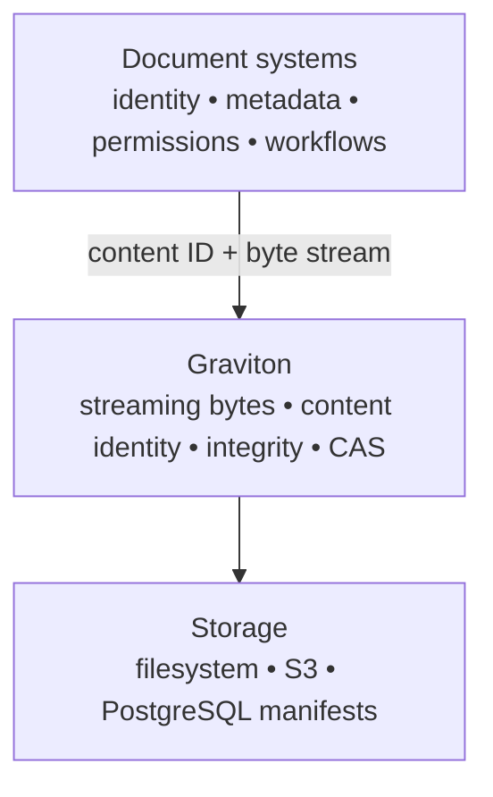

# Scope and product boundary

Graviton is a storage substrate for immutable byte content. It accepts a stream, derives cryptographic content identity, stores bounded blocks and manifests, and returns the same bytes as a stream.

## Graviton owns

- streaming upload and download;
- bounded chunking and block-level deduplication;
- content IDs derived from hash algorithm, digest, and byte length;
- immutable block and manifest persistence;
- integrity verification against persisted bytes;
- filesystem, S3-compatible, and PostgreSQL storage composition;
- replication primitives, maintenance coordination, and optional Shardcake upload locality;
- transport authentication, authorization policy, audit events, health, and metrics.

## Graviton does not own

- document IDs, document versions, or aliases;
- business metadata, schemas, or provenance;
- folders as a durable document-domain hierarchy;
- permissions expressed in document-domain terms;
- search, extraction, embeddings, or indexing;
- workflow, review, retention, or case-management state.

The local console includes mutable filenames and folders so an operator can organize references to immutable blobs. Those references are a local catalog convenience. They are not a document model, and deleting one does not silently delete shared CAS blocks.

## Where Quasar fits

Quasar is an internal document layer built above Graviton. It can associate document identity, versions, metadata, permissions, and workflows with opaque Graviton content IDs while leaving byte storage to Graviton.

Quasar is not a dependency of `graviton-server`, is not published as a Graviton Maven artifact, and exposes no endpoint through the packaged Graviton process. This repository retains source-only Quasar prototypes and design material for internal integration work; they are excluded from the public documentation navigation and release assets.

The dependency direction is one-way: a document system may consume Graviton, but Graviton does not need to understand a document.
