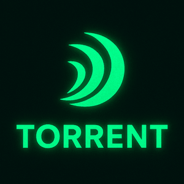

# Torrent



A ZIO-native Content-Addressable Storage system designed for high performance and reliability.

## Features

### Content-Addressable Storage
Store and retrieve content efficiently using content-based addressing. Torrent ensures data integrity and eliminates duplicates automatically.

### Smart Chunking
Intelligent deduplication through advanced chunking strategies. Our rolling hash algorithm provides optimal chunk boundaries for maximum storage efficiency.

### Format-Aware Processing
Handle different file formats with built-in content detection. Torrent automatically recognizes and processes various file formats appropriately.

### Type-Safe Error Handling
Built on ZIO for robust error handling and type safety. All operations are fully typed and errors are handled explicitly.

## Quick Links

- 🚀 [Quick Start Guide](getting-started/quick-start.md)
- 🔧 [Installation Guide](getting-started/installation.md)
- 📚 [Core Concepts](core-concepts/index.md)
- 📖 [API Reference](api-reference/index.md)
- 💡 [Contributing](contributing.md)

## Getting Started

```scala
import torrent._

val storage = TorrentStorage.create()
for {
  // Store some content
  key <- storage.store("Hello, World!".getBytes)
  
  // Retrieve it later
  content <- storage.retrieve(key)
} yield content
```

## Documentation Sections

- **[Core Concepts](core-concepts/index.md)**: Understand the fundamental principles behind Torrent
- **[API Reference](api-reference/index.md)**: Detailed documentation of all APIs and components
- **[Features](features/index.md)**: Explore Torrent's capabilities and use cases
- **[Guides](guides/index.md)**: Step-by-step tutorials and best practices

## Community

We welcome contributions! Check out our [contribution guidelines](contributing.md) to get started.

---

*Built with ZIO ❤️* 